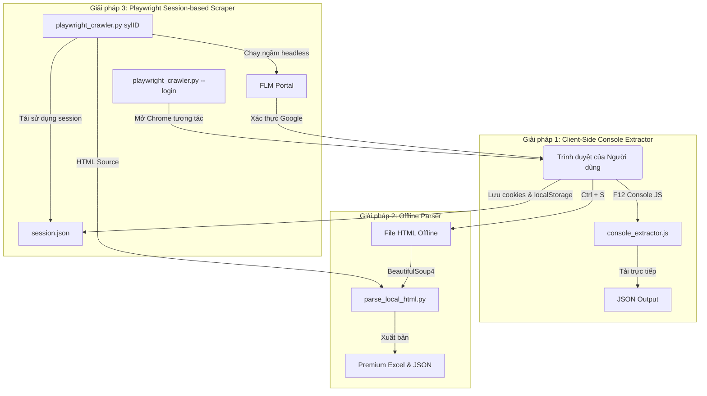

# BÁO CÁO GIẢI PHÁP KỸ THUẬT - FLM SYLLABUS EXTRACTOR

Báo cáo này trình bày kiến trúc, thách thức kỹ thuật, các giải pháp thiết kế và cơ chế triển khai của bộ công cụ cào dữ liệu Syllabus từ hệ thống Quản lý Syllabus của Đại học FPT (FLM).

---

## 1. Phân Tích Thách Thức Kỹ Thuật (Problem Analysis)

Hệ thống FLM (`flm.fpt.edu.vn`) áp dụng các rào cản bảo mật tiêu chuẩn khiến các công cụ cào dữ liệu (crawler) truyền thống dễ bị chặn đứng:

1. **Rào cản Xác thực (Authentication Barrier)**:
   * FLM yêu cầu xác thực thông qua Google OAuth 2.0 bằng tài khoản thư điện tử tổ chức (`@fpt.edu.vn` hoặc `@fe.edu.vn`).
   * Các yêu cầu HTTP gửi trực tiếp bằng thư viện như `requests` (Python) hay `axios` (Node.js) nếu không có session cookies sẽ lập tức nhận phản hồi redirect (mã trạng thái 302) về trang đăng nhập của Google.
   
2. **Chống Tự động hóa của Google (Google Anti-Bot)**:
   * Google OAuth có hệ thống phát hiện bot tinh vi. Nếu sử dụng các công cụ tự động hóa trình duyệt như Selenium hay Playwright ở chế độ ẩn danh (headless) để cố gắng điền thông tin đăng nhập tự động, Google sẽ chặn truy cập với lý do "Trình duyệt không an toàn" (Insecure Browser).

3. **Cấu trúc Trang Phức tạp (DOM Layout)**:
   * Bố cục HTML của trang Syllabus chứa nhiều bảng lồng nhau, nhãn trường (labels) có thể thay đổi ngôn ngữ giữa tiếng Anh và tiếng Việt tùy tài khoản. Các bảng biểu (Weekly Schedule, Assessment Scheme) có kích thước động và số lượng cột khác nhau tùy theo cấu trúc thiết kế của từng bộ môn.

---

## 2. Thiết Kế Kiến Trúc Giải Pháp (System Design)

Để giải quyết triệt để các thách thức trên một cách linh hoạt, dự án đã thiết kế mô hình **Kiến trúc Lai (Hybrid Architecture)** tích hợp 3 giải pháp độc lập bổ trợ cho nhau:

### 🔹 Giải pháp 1: Console Extractor (`console_extractor.js`)
* **Cơ chế**: Đoạn mã JavaScript thuần chạy trực tiếp trong môi trường sandbox của trình duyệt người dùng.
* **Ưu điểm**: 
  * Tận dụng 100% phiên đăng nhập hợp lệ sẵn có của người dùng, vượt qua hoàn toàn Cloudflare, Google Auth hay mọi tường lửa.
  * Không phụ thuộc môi trường cài đặt bên ngoài (no-install, zero dependencies).
* **Kỹ thuật**: Sử dụng các Selector DOM động (`querySelectorAll`, từ khóa đồng nghĩa) để tìm kiếm các bảng biểu tương ứng và dùng đối tượng `Blob` kết hợp URL ảo để tự động kích hoạt tiến trình tải xuống file JSON từ Client-Side.

### 🔹 Giải pháp 2: Local HTML Parser (`parse_local_html.py`)
* **Cơ chế**: Script Python xử lý luồng dữ liệu offline ngoại tuyến.
* **Kỹ thuật**:
  * **Trích xuất thông tin (DOM Parsing)**: Sử dụng thư viện `BeautifulSoup4` với parser `lxml` tốc độ cao. Dữ liệu văn bản được làm sạch (chuẩn hóa khoảng trắng, loại bỏ ký tự rác).
  * **Xử lý từ khóa đồng nghĩa**: Phân tích cú pháp linh hoạt dựa trên cơ chế so khớp từ khóa không phân biệt hoa thường và hỗ trợ cả tiếng Anh lẫn tiếng Việt (ví dụ: khớp cả `Subject code` và `Mã môn học`).
  * **Xuất bản dữ liệu**: Tách biệt luồng ghi ra file JSON gốc để phục vụ việc lập chỉ mục (indexing) hoặc tích hợp API, và luồng ghi ra Excel cao cấp.

### 🔹 Giải pháp 3: Playwright Crawler (`playwright_crawler.py`)
* **Cơ chế**: Sử dụng Playwright (thư viện tự động hóa trình duyệt hiện đại nhất hiện nay) hoạt động theo cơ chế **Thu thập & Tái sử dụng Phiên (Session Capturing & Re-use)**.
* **Kỹ thuật**:
  * **Bước Login**: Mở trình duyệt ở chế độ hiển thị (headful) với cấu hình User-Agent giả lập trình duyệt thật để người dùng tự tay vượt qua bước Google Login an toàn. Sau khi hoàn tất, script gọi hàm `context.storage_state()` để ghi nhận toàn bộ Cookies và LocalStorage vào file bảo mật `session.json`.
  * **Bước Scrape**: Trình duyệt chạy ngầm (headless), khởi tạo context kèm theo tham số `storage_state="session.json"`. Trình duyệt sẽ tự động mang theo token xác thực hợp lệ để truy cập trực tiếp vào hàng loạt Syllabus ID mong muốn, chụp lại mã nguồn HTML sau khi đã render Javascript và truyền vào lõi phân tích của giải pháp 2 để xuất file.

---

## 3. Giải Pháp Tối Ưu Hóa Trải Nghiệm & Thẩm Mỹ (Premium UX/UI Details)

Điểm nổi bật của dự án là khả năng tạo ra các tài liệu báo cáo dữ liệu định dạng **Excel với tiêu chuẩn thẩm mỹ cao (Premium Quality)** thông qua thư viện `openpyxl`:

* **Bảng màu đồng bộ (Brand Identity)**: Sử dụng tông màu cam sẫm thanh lịch làm chủ đạo (`#FF8C00` - tương thích với màu nhận diện thương hiệu của FPT), phối hợp với màu nền xen kẽ nhẹ (`#FFF8F0`) trên các dòng của bảng biểu lớn để tối ưu khả năng đọc (readability).
* **Typography hiện đại**: Thiết lập font chữ thống nhất là `Segoe UI` - tối ưu hóa hiển thị sắc nét trên cả màn hình Windows lẫn macOS, độ rộng các trường tiêu đề và nội dung được tự động co giãn thông minh (Auto-adjust width) tối đa 55 ký tự để tránh hiện tượng tràn cột hoặc vỡ bố cục.
* **Trực quan hóa cấu trúc dữ liệu**:
  * File Excel xuất ra được phân bổ khoa học thành **7 trang tính (Sheets)** riêng biệt giúp người đọc nắm bắt thông tin tối ưu:
    1. **General Info**: Thông tin tổng quan về đề cương, bao gồm mã môn, tên môn, số tín chỉ, quyết định số, thang điểm, mô tả khóa học đầy đủ (`Description`) và nhiệm vụ chi tiết sinh viên (`Student Tasks`).
    2. **Materials**: Liệt kê chi tiết 100% học liệu (videos, giáo trình, đường dẫn link) bao gồm tác giả, năm sản xuất, mã ISBN, loại hình xuất bản và ghi chú.
    3. **CLOs**: Định vị chính xác chuẩn đầu ra của khóa học (Course Learning Outcomes) tương thích với LO.
    4. **Weekly Schedule**: Chi tiết lịch trình buổi học với thuộc tính tự động xuống dòng (Wrap Text) và chiều cao hàng tăng cường (45pt) để hiển thị trọn vẹn giáo án của giảng viên và nhiệm vụ của học sinh.
    5. **Constructive Questions**: Lưu trữ danh sách toàn bộ các câu hỏi kiến tạo thảo luận Edunext (đối với EXE101 là 28 câu hỏi), liên kết chính xác với từng số buổi học để thuận tiện cho sinh viên tra cứu chuẩn bị bài.
    6. **Assessment Scheme**: Bảng trọng số phân bổ điểm đủ **12 cột** đầy đủ thông tin nhất (bao gồm cả `Knowledge and Skill`, hướng dẫn chấm điểm `Grading Guide` và ghi chú `Note` chi tiết cho từng đầu điểm).
    7. **References**: Danh mục giáo trình định dạng tài liệu khoa học chuẩn.
  * **Cơ chế Tự Phục hồi Lỗi file khóa (Lock Self-healing)**: Khi file Excel đầu ra đang mở trong Microsoft Excel, chương trình sẽ tự động chuyển hướng lưu trữ sang tên mới `<MÃ_MÔN>_details_new.xlsx` thay vì gây crash ứng dụng, đảm bảo tính liên tục của trải nghiệm cào dữ liệu.

---

## 4. Hướng Phát Triển Tích Hợp (Future Integration)

Dữ liệu JSON đầu ra chuẩn hóa từ bộ công cụ này là nguồn nguyên liệu chất lượng cao cho các ứng dụng giáo dục thông minh:
1. **Chatbot RAG (Retrieval-Augmented Generation)**: Chuyển đổi dữ liệu JSON thành các vector embedding nạp vào cơ sở dữ liệu tri thức (Vector DB) để chatbot tư vấn lộ trình học tập FPT có thể trả lời chi tiết và chính xác về đề cương chi tiết của từng môn học.
2. **Hệ thống Quản lý Kế hoạch cá nhân**: Tự động liên kết lịch trình buổi học (Weekly Schedule) với lịch cá nhân của sinh viên để nhắc nhở nhiệm vụ bài tập và tài liệu cần đọc trước khi lên lớp.

---

## 5. Thiết Kế Cơ Sở Dữ Liệu Tích Hợp (Database Schema Design)

Dựa trên kết quả cào và phân tích đối chiếu thực tế của 3 môn học tiêu biểu: **EXE101** (Trải nghiệm khởi nghiệp 1 - ID 10358), **EXE201** (Trải nghiệm khởi nghiệp 2 - ID 10361) và **FER202** (Front-End với React - ID 12580), cấu trúc đề cương chi tiết của FPT FLM có **độ đồng nhất cấu trúc là 100%**. 

Để lưu trữ vĩnh viễn và phục vụ xây dựng các phần mềm học tập, chúng tôi đã hoàn thiện hai mô hình cơ sở dữ liệu chuẩn hóa:
* **Mô hình Cơ sở dữ liệu quan hệ (SQL/PostgreSQL DDL)**: Chuẩn hóa cao, khóa ngoại tự động xóa cascade, đánh chỉ mục tối ưu trên `subject_code` và `session`.
* **Mô hình Cơ sở dữ liệu hướng tài liệu (NoSQL/MongoDB)**: Lưu trữ nguyên bản JSON dưới dạng Single Complex Document phục vụ hiển thị Web UI siêu tốc với độ trễ thấp.

> [!NOTE]
> Chi tiết tài liệu thiết kế cơ sở dữ liệu, mã DDL PostgreSQL, MongoDB validation rule, sơ đồ ERD trực quan hóa đầy đủ và file đặc tả DBML tương tác đã được biên soạn bằng tiếng Việt tại: **[THIET_KE_CSDL.md](file:///e:/FPT/Semester_7/SDN302/test/test-crawl-syllabus/docs/THIET_KE_CSDL.md)** và **[schema.dbml](file:///e:/FPT/Semester_7/SDN302/test/test-crawl-syllabus/docs/schema.dbml)**.

