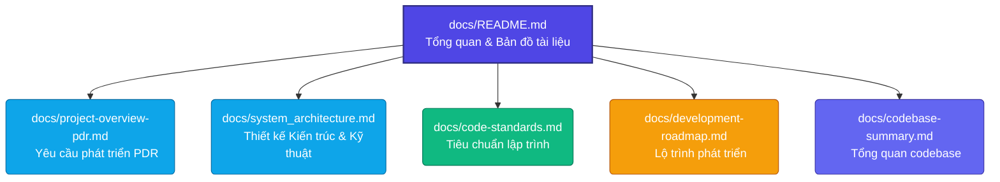

# HỆ THỐNG CHATBOT RAG HỖ TRỢ HỌC TẬP FPTU
## Tài Liệu Kỹ Thuật — Bản Đồ Tài Liệu Dự Án

Chào mừng bạn đến với thư mục tài liệu kỹ thuật của dự án **FPTU Chatbot RAG**. Dự án này được phát triển nhằm giải quyết nhu cầu tra cứu và hỏi đáp tài liệu môn học của sinh viên FPT University bằng phương pháp **Retrieval-Augmented Generation (RAG)** tối ưu cho tiếng Việt.

---

## Tổng Quan Dự Án

* **Tên dự án:** FPTU Chatbot RAG — Hệ thống truy xuất kiến thức đa phương thức
* **Mục tiêu:** Web app cho phép Giảng viên tải lên tài liệu (Syllabus, Slide, PDF) và Sinh viên hỏi đáp thông minh theo phương pháp RAG
* **Đối tượng:** Sinh viên, Giảng viên và Quản trị viên FPT University

---

## Tech Stack Hiện Tại

| Layer | Technology | Version |
|-------|------------|---------|
| Backend API | Hono.js | 4.12.19 |
| Language | TypeScript | 5.8.3 |
| ORM | Prisma | 5.18.0 |
| Auth | Better Auth | 1.6.11 |
| Frontend | Next.js | 16.2.7 |
| UI Library | React | 19.2.4 |
| UI Components | Mantine UI | 9.3.0 |
| Styling | Tailwind CSS | 4 |
| Build | Turborepo | latest |
| Vector DB | Qdrant | latest |
| Embedding | Gemini embedding-002 | 3072-dim |
| LLM | Gemini Flash (streaming) | latest |
| Database | PostgreSQL | latest |
| Cache | Redis | latest |
| Logging | Winston | 3.19.0 |

---

## Bản Đồ Tài Liệu (Documentation Map)

---

## Chuyên Đề Phát Triển Hệ Thống

1. **[Tài liệu Yêu cầu Phát triển (PDR)](./project-overview-pdr.md)**
   * Mô hình Actor: Student, Lecturer, Super Admin
   * Các tính năng chính: Curriculum/Syllabus CRUD, Document Upload, RAG Chat
   * API endpoints specification đầy đủ
   * Database schema thực tế (21 models, FPTU academic domain)

2. **[Thiết kế Kiến trúc & Kỹ thuật](./system_architecture.md)**
   * Sơ đồ kiến trúc Turborepo Monorepo (Next.js 16 + Hono.js)
   * Data Flow: Document Ingestion Pipeline & RAG Chat Flow
   * FPTU domain hierarchy: Major → Specialization → Curriculum → Course → Syllabus → Document
   * Bảo mật: session-based auth + Qdrant data isolation

3. **[Tiêu chuẩn lập trình](./code-standards.md)**
   * TypeScript strict mode + naming conventions
   * Hono.js controller & repository pattern
   * Mantine UI conventions
   * Quy tắc bảo mật RAG (Qdrant vector isolation)
   * Commit conventions (tiếng Việt, conventional commits)

4. **[Lộ trình phát triển](./development-roadmap.md)**
   * 6 giai đoạn phát triển với tiến độ thực tế
   * Các tính năng đã hoàn thành vs. kế hoạch

5. **[Tổng quan codebase](./codebase-summary.md)**
   * Thống kê LOC (~15k API, ~7k Web)
   * Module breakdown + API routes mapping
   * Development commands (Makefile shortcuts)

---

## Tài Liệu Bổ Sung

| File | Mô tả |
|------|-------|
| [running_guide.md](./running_guide.md) | Hướng dẫn cài đặt và chạy hệ thống chi tiết |
| [better_auth_guide.md](./better_auth_guide.md) | Hướng dẫn tích hợp và cấu hình Better Auth |
| [hono_guide.md](./hono_guide.md) | Hướng dẫn phát triển Hono.js API |
| [db-query-guild.md](./db-query-guild.md) | Hướng dẫn viết Prisma queries tối ưu |
| [docker-build-push.md](./docker-build-push.md) | Hướng dẫn build & push Docker images |
| [api/](./api/) | API documentation (OpenAPI format) |
| [srs/](./srs/) | Software Requirements Specification chi tiết |

---

## Sản Phẩm Bàn Giao (Deliverables)

| STT | Sản phẩm bàn giao | Mô tả | Trạng thái |
|:---:|---|---|:---:|
| **1** | **Web App Chatbot** | Hệ thống web với giao diện Mantine UI, RAG chat scoping 3 mode, Teacher/Student/Admin portals | *Đang phát triển* |
| **2** | **Source Code GitHub** | Monorepo `web/` (Next.js) + `api/` (Hono.js), quản lý bởi Turborepo | *Đã triển khai* |
| **3** | **Tài liệu Kỹ thuật** | PDR, Kiến trúc, Code Standards, Roadmap — trong thư mục `docs/` | *Đang cập nhật* |

---

> [!NOTE]
> Hệ thống sử dụng **Gemini Embedding 002** (3072-dim) cho Multimodal Embedding và **BAAI/bge-vi-base** cho Vietnamese text retrieval tối ưu. Chat sessions hỗ trợ 3 chế độ scoping: `ALL_COURSES`, `SELECTED_COURSES`, và `SELECTED_DOCUMENTS`.

> **Last Updated:** 2026-06-05