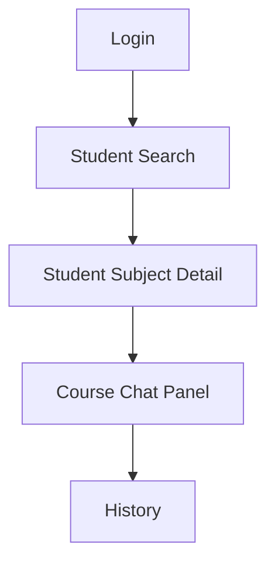
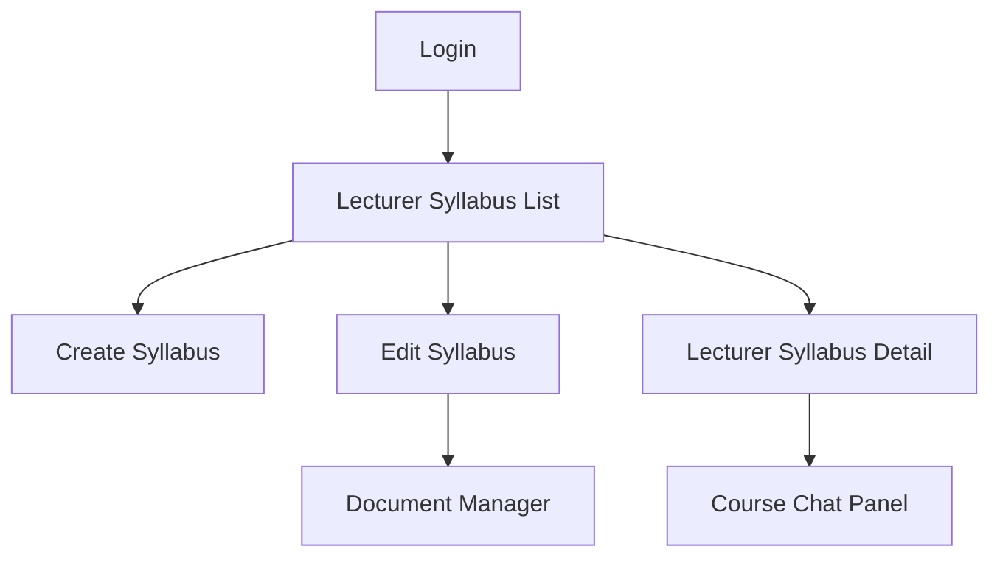
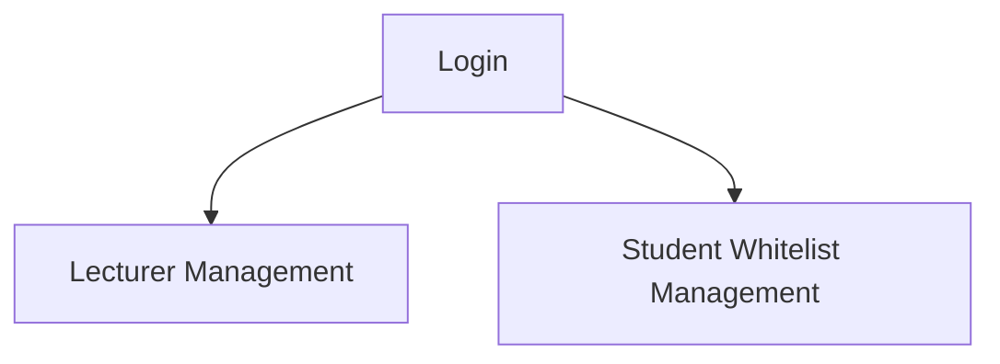

# User Flows

> Phiên bản: 1.0  
> Cập nhật: 2026-06-23

## Student

## Lecturer

## Super Admin

## Notes

- `STUDENT` chỉ chat từ syllabus public `approved + active`
- `LECTURER` chat từ `Lecturer Syllabus Detail` của syllabus đang chọn
- `Document Manager` chỉ cho `PDF`; snapshot syllabus do hệ thống tự sinh
- Không có flow `lecturer request`
