# Use Cases

> Phiên bản: 1.0  
> Cập nhật: 2026-06-23

```mermaid
graph TB
    SA["ADMIN"]
    LE["LECTURER"]
    ST["STUDENT"]
    SYS["SYSTEM"]

    ST --> A["Login bằng Google"]
    ST --> B["Search subject theo code hoặc tên"]
    ST --> C["View subject detail"]
    ST --> D["Open course chat"]
    ST --> E["Ask question"]
    ST --> F["View history"]

    LE --> G["Login bằng email/password"]
    LE --> H["Create syllabus"]
    LE --> I["Edit syllabus"]
    LE --> J["Approve syllabus"]
    LE --> K["Activate syllabus"]
    LE --> L["View syllabus detail"]
    LE --> M["Open syllabus chat"]
    LE --> N["Upload PDF"]
    LE --> O["Delete PDF"]

    SA --> P["Create lecturer"]
    SA --> Q["Disable lecturer"]
    SA --> QA["Enable lecturer"]
    SA --> R["Manage whitelist"]

    SYS --> S["Generate syllabus snapshot"]
    SYS --> T["Sync docs to AnythingLLM"]
    SYS --> U["Syllabus-scoped retrieval"]
    SYS --> V["Return answer/refusal"]
```

## Danh sách use case

- UC-01: Student login
- UC-02: Search subject
- UC-03: View subject detail
- UC-04: Open course chat
- UC-05: Ask question
- UC-06: View chat history
- UC-07: Lecturer login
- UC-08: Create syllabus
- UC-09: Edit syllabus
- UC-10: Approve syllabus
- UC-11: Activate syllabus
- UC-12: View syllabus detail
- UC-13: Open syllabus chat
- UC-14: Upload PDF
- UC-15: Delete PDF
- UC-16: Create lecturer
- UC-17: Disable lecturer
- UC-18: Manage whitelist
- UC-19: Generate syllabus snapshot
- UC-20: Sync docs to AnythingLLM
- UC-21: Syllabus-scoped retrieval
- UC-22: Return answer or refusal

## Ghi chú chốt scope

- `lecturer request` không còn là use case chính thức; chỉ còn legacy route bị khóa
- Không có use case `video URL`
- Không có use case `cross-subject chat`
