# THIẾT KẾ CƠ SỞ DỮ LIỆU - FPT FLM SYLLABUS

Tài liệu này trình bày thiết kế chi tiết hệ thống cơ sở dữ liệu (Database Schema) để lưu trữ và quản lý dữ liệu Syllabus (Đề cương chi tiết môn học) được trích xuất tự động từ hệ thống FPT FLM (`flm.fpt.edu.vn`).

Thiết kế này hỗ trợ hai mô hình lưu trữ phổ biến nhất: **Cơ sở dữ liệu quan hệ (PostgreSQL)** và **Cơ sở dữ liệu hướng tài liệu (MongoDB)**, dựa trên kết quả phân tích cấu trúc thực tế của các môn học khác nhau (EXE101, EXE201, FER202).

---

## 🔍 1. Kết Quả Phân Tích Đối Chiếu Cấu Trúc Thực Tế

Để đảm bảo tính tổng quát của cơ sở dữ liệu, chúng tôi đã tiến hành cào dữ liệu thực tế và đối chiếu cấu trúc của 3 Syllabus thuộc các nhóm môn học khác nhau:
1. **Syllabus ID `10358` (EXE101 - Trải nghiệm khởi nghiệp 1):** Môn dự án, có câu hỏi thảo luận kiến tạo Edunext.
2. **Syllabus ID `10361` (EXE201 - Trải nghiệm khởi nghiệp 2):** Môn dự án nâng cao.
3. **Syllabus ID `12580` (FER202 - Lập trình Front-End với React):** Môn học lý thuyết & thực hành kỹ thuật.

### Bảng Kết Quả Đối Chiếu Cấu Trúc:

| Thành Phần Dữ Liệu | EXE101 (`10358`) | EXE201 (`10361`) | FER202 (`12580`) | Mức Độ Đồng Nhất |
| :--- | :---: | :---: | :---: | :---: |
| **Cấu trúc JSON tổng quan** | 7 Nhóm Khóa | 7 Nhóm Khóa | 7 Nhóm Khóa | **100% Đồng Nhất** |
| **Số lượng trường Metadata** | 18 Trường | 18 Trường | 18 Trường | **100% Đồng Nhất** |
| **Cột bảng Vật liệu (Materials)**| 10 Cột | 10 Cột | 10 Cột | **100% Đồng Nhất** |
| **Cột bảng Chuẩn đầu ra (CLOs)**| 3 Cột | 3 Cột | 3 Cột | **100% Đồng Nhất** |
| **Cột bảng Lịch trình (Schedule)**| 9 Cột | 9 Cột | 9 Cột | **100% Đồng Nhất** |
| **Bảng Câu hỏi Kiến tạo (Edunext)**| 28 Câu hỏi | 0 Câu hỏi | 0 Câu hỏi | **Khớp cấu trúc (0-n)** |
| **Cột bảng Phân bổ điểm (Assessment)**| 12 Cột | 12 Cột | 12 Cột | **100% Đồng Nhất** |
| **Danh mục Tài liệu tham khảo** | Dạng mảng chữ | Dạng mảng chữ | Dạng mảng chữ | **100% Đồng Nhất** |

> [!IMPORTANT]
> **Nhận xét quan trọng:**
> Cấu trúc đề cương chi tiết của Đại học FPT trên hệ thống FLM có tính **đồng nhất và chuẩn hóa cực kỳ cao**. 
> * **Số lượng chuẩn đầu ra (CLOs) động:** Số lượng CLO không cố định mà thay đổi linh hoạt theo từng môn học (ví dụ: EXE101 có 3 CLOs, PRN232 có 5 CLOs, FER202 có 9 CLOs). Thiết kế quan hệ 1-n (PostgreSQL) và mảng nhúng (MongoDB) trong đặc tả này đáp ứng hoàn toàn tính động này.
> * Sự khác biệt duy nhất nằm ở bảng **Câu hỏi kiến tạo (Constructive Questions)**: Chỉ xuất hiện ở môn học áp dụng phương pháp Edunext (như EXE101). Các môn học khác sẽ trả về danh sách rỗng (`0` bản ghi).
> * Bảng **Phân bổ điểm (Assessment Scheme)** luôn hỗ trợ đầy đủ cấu trúc **12 cột** nâng cao để lưu trữ các tiêu chí kiến thức/kỹ năng (`Knowledge and Skill`), hướng dẫn chấm điểm (`Grading Guide`) và ghi chú thi cử (`Note`).
>
> Do đó, chúng ta hoàn toàn có thể thiết kế một **hệ cơ sở dữ liệu duy nhất** đáp ứng hoàn hảo 100% cấu trúc của mọi môn học tại Đại học FPT.

---

## 📊 2. Sơ Đồ Quan Hệ Thực Thể (ERD - Entity Relationship Diagram)

Sơ đồ dưới đây mô tả cấu trúc quan hệ giữa bảng thông tin chung Syllabus và các bảng thành phần chi tiết của đề cương:

```mermaid
erDiagram
    SYLLABUS ||--o{ SYLLABUS_MATERIAL : "has"
    SYLLABUS ||--o{ SYLLABUS_CLO : "defines"
    SYLLABUS ||--o{ SYLLABUS_SCHEDULE : "scheduled_by"
    SYLLABUS ||--o{ CONSTRUCTIVE_QUESTION : "asks"
    SYLLABUS ||--o{ ASSESSMENT_SCHEME : "graded_by"
    SYLLABUS ||--o{ SYLLABUS_REFERENCE : "references"

    SYLLABUS {
        int id PK "Syllabus ID của FLM (Ví dụ: 10358)"
        varchar subject_code "Mã môn học (Ví dụ: EXE101) [Đã tạo Index]"
        varchar syllabus_name "Tên tiếng Việt đề cương"
        varchar syllabus_name_english "Tên tiếng Anh đề cương"
        int credits "Số tín chỉ"
        varchar degree_level "Hệ đào tạo (Ví dụ: Bachelor)"
        text time_allocation "Phân bổ thời gian tự học/lên lớp"
        text prerequisites "Môn học tiên quyết"
        text description "Mô tả chi tiết môn học"
        text student_tasks "Nhiệm vụ của sinh viên"
        text tools "Công cụ và phần mềm cần thiết"
        varchar scoring_scale "Thang điểm chấm (Ví dụ: 10)"
        varchar decision_no "Quyết định phê duyệt số"
        date approved_date "Ngày quyết định phê duyệt"
        numeric min_avg_mark_to_pass "Điểm trung bình tối thiểu để qua môn"
        boolean is_active "Trạng thái hoạt động"
        boolean is_approved "Trạng thái phê duyệt"
        text note "Ghi chú thêm"
        timestamp created_at "Thời gian tạo bản ghi"
        timestamp updated_at "Thời gian cập nhật bản ghi"
    }

    SYLLABUS_MATERIAL {
        int id PK "Khóa chính tự tăng"
        int syllabus_id FK "Liên kết Syllabus ID [Xóa Cascade]"
        text description "Mô tả học liệu / Tên sách"
        varchar author "Tác giả"
        varchar publisher "Nhà xuất bản"
        varchar published_date "Năm / Ngày xuất bản"
        varchar edition "Phiên bản / Lần tái bản"
        varchar isbn "Mã vạch ISBN"
        varchar is_main_material "Học liệu chính hay phụ"
        varchar is_hard_copy "Sách giáo trình giấy"
        varchar is_online "Học liệu trực tuyến"
        text note "Ghi chú thêm"
    }

    SYLLABUS_CLO {
        int id PK "Khóa chính tự tăng"
        int syllabus_id FK "Liên kết Syllabus ID [Xóa Cascade]"
        varchar clo_name "Ký hiệu chuẩn đầu ra (Ví dụ: CLO1 - lấy từ clo_details trong JSON)"
        text clo_details "Nội dung mô tả CLO chi tiết (lấy từ lo_details trong JSON)"
        text lo_details "Mã số CLO/LO liên kết tương ứng (lấy từ clo_name trong JSON)"
    }

    SYLLABUS_SCHEDULE {
        int id PK "Khóa chính tự tăng"
        int syllabus_id FK "Liên kết Syllabus ID [Xóa Cascade]"
        int session "Số buổi học [Đã tạo Index]"
        text topic "Chủ đề / Nội dung buổi học"
        varchar learning_method "Hình thức học (Online / Offline)"
        varchar lo "Các CLO được đáp ứng (Danh sách ngăn cách bởi dấu phẩy)"
        varchar itu "Mức độ giảng dạy (Introduce / Teach / Utilize)"
        text student_materials "Học liệu sinh viên cần đọc"
        text s_download "Tài liệu giảng viên cung cấp"
        text student_tasks "Nhiệm vụ sinh viên trong buổi học"
        text urls "Đường dẫn bài giảng / Slide / Video"
    }

    CONSTRUCTIVE_QUESTION {
        int id PK "Khóa chính tự tăng"
        int syllabus_id FK "Liên kết Syllabus ID [Xóa Cascade]"
        int session_no "Số buổi học liên kết"
        varchar name "Mã câu hỏi kiến tạo (Ví dụ: HCM1.1)"
        text details "Nội dung chi tiết câu hỏi"
    }

    ASSESSMENT_SCHEME {
        int id PK "Khóa chính tự tăng"
        int syllabus_id FK "Liên kết Syllabus ID [Xóa Cascade]"
        varchar category "Loại điểm (Ví dụ: Progress Assessment)"
        varchar type "Hình thức chấm (Ví dụ: on-going / final)"
        varchar part "Phần chấm điểm"
        numeric weight "Trọng số phần trăm (Ví dụ: 15.00 tương ứng 15%)"
        text completion_criteria "Điều kiện tối thiểu để hoàn thành"
        varchar duration "Thời gian làm bài (Ví dụ: 15' hoặc 60 mins)"
        varchar clo "Mức độ CLO đáp ứng (Ví dụ: CLO1 hoặc 'all')"
        varchar question_type "Dạng câu hỏi kiểm tra"
        varchar no_question "Số lượng câu hỏi"
        text knowledge_and_skill "Mô tả Kiến thức & Kỹ năng cần đạt (Cột 10)"
        text grading_guide "Hướng dẫn giảng viên chấm bài (Cột 11)"
        text note "Ghi chú cách tính điểm đặc biệt (Cột 12)"
    }

    SYLLABUS_REFERENCE {
        int id PK "Khóa chính tự tăng"
        int syllabus_id FK "Liên kết Syllabus ID [Xóa Cascade]"
        text citation "Chuỗi trích dẫn tài liệu tham khảo chính quy"
    }
```



### 🗄️ 2.1 Tài Liệu Mô Tả Schema DBML (Database Markup Language)

Chúng tôi đã viết một file DBML chi tiết để phục vụ việc thiết kế trực quan tại: [schema.dbml](file:///e:/FPT/Semester_7/SDN302/test/test-crawl-syllabus/docs/schema.dbml).

**Hướng dẫn sử dụng nhanh:**
1. Mở trang web [dbdiagram.io Playground](https://dbdiagram.io/playground).
2. Mở file [schema.dbml](file:///e:/FPT/Semester_7/SDN302/test/test-crawl-syllabus/docs/schema.dbml) trên IDE của bạn, sao chép toàn bộ nội dung của file.
3. Dán (Paste) nội dung đó vào bảng biên tập bên trái của trang **dbdiagram.io**.
4. Hệ thống sẽ tự động vẽ một sơ đồ ERD chi tiết, cực đẹp, hỗ trợ di chuyển các bảng, thu phóng, tìm kiếm trường và làm nổi bật các mối quan hệ (Ref) khi bạn click vào.
5. Bạn có thể chọn **Export** ở góc trên cùng của trang web để sinh tự động mã DDL SQL cho **PostgreSQL**, **MySQL**, **SQL Server** hay **Oracle**.

---

## 🐘 3. Cơ Sở Dữ Liệu Quan Hệ (PostgreSQL DDL)

Đoạn mã SQL dưới đây thiết lập toàn bộ cấu trúc bảng, các ràng buộc toàn vẹn dữ liệu (`NOT NULL`, `FOREIGN KEY`), thiết lập cập nhật tự động `updated_at` và tạo các chỉ mục (`INDEX`) để tối ưu hóa hiệu năng tìm kiếm đề cương:

```sql
-- Tạo hàm tự động cập nhật thời gian chỉnh sửa (updated_at)
CREATE OR REPLACE FUNCTION update_modified_column()
RETURNS TRIGGER AS $$
BEGIN
    NEW.updated_at = now();
    RETURN NEW;
END;
$$ language 'plpgsql';

-- 1. BẢNG THÔNG TIN CHUNG SYLLABUS
CREATE TABLE syllabuses (
    id INT PRIMARY KEY, -- Sử dụng ID Syllabus của FLM làm Khóa chính (Cần parse từ chuỗi syllabus_id trong JSON)
    subject_code VARCHAR(50) NOT NULL,
    syllabus_name VARCHAR(255) NOT NULL,
    syllabus_name_english VARCHAR(255),
    credits INT NOT NULL DEFAULT 3, -- Số tín chỉ (Cần parse từ chuỗi trong JSON)
    degree_level VARCHAR(100) DEFAULT 'Bachelor',
    time_allocation TEXT,
    prerequisites TEXT,
    description TEXT,
    student_tasks TEXT,
    tools TEXT,
    scoring_scale VARCHAR(50) DEFAULT '10',
    decision_no VARCHAR(150),
    approved_date DATE, -- Ngày quyết định phê duyệt (Cần parse định dạng ngày hoặc chuyển chuỗi rỗng thành NULL)
    min_avg_mark_to_pass NUMERIC(4, 2) DEFAULT 5.0, -- Điểm trung bình tối thiểu để qua môn (Cần parse từ chuỗi)
    is_active BOOLEAN DEFAULT TRUE, -- Trạng thái hoạt động (Cần parse từ chuỗi 'True'/'False')
    is_approved BOOLEAN DEFAULT TRUE, -- Trạng thái phê duyệt (Cần parse từ chuỗi 'True'/'False')
    note TEXT,
    created_at TIMESTAMP WITH TIME ZONE DEFAULT CURRENT_TIMESTAMP,
    updated_at TIMESTAMP WITH TIME ZONE DEFAULT CURRENT_TIMESTAMP
);

-- Index giúp tìm kiếm đề cương cực nhanh bằng Mã Môn học (Ví dụ: 'EXE101')
CREATE INDEX idx_syllabuses_subject_code ON syllabuses (subject_code);

-- Gán trigger cập nhật thời gian tự động
CREATE TRIGGER update_syllabuses_updated_at 
BEFORE UPDATE ON syllabuses 
FOR EACH ROW EXECUTE PROCEDURE update_modified_column();


-- 2. BẢNG HỌC LIỆU MÔN HỌC (MATERIALS)
CREATE TABLE syllabus_materials (
    id SERIAL PRIMARY KEY,
    syllabus_id INT NOT NULL REFERENCES syllabuses(id) ON DELETE CASCADE,
    description TEXT NOT NULL,
    author VARCHAR(255),
    publisher VARCHAR(255),
    published_date VARCHAR(100),
    edition VARCHAR(100),
    isbn VARCHAR(100),
    is_main_material VARCHAR(50),
    is_hard_copy VARCHAR(50),
    is_online VARCHAR(50),
    note TEXT
);
CREATE INDEX idx_materials_syllabus_id ON syllabus_materials (syllabus_id);


-- 3. BẢNG CHUẨN ĐẦU RA MÔN HỌC (CLOS)
CREATE TABLE syllabus_clos (
    id SERIAL PRIMARY KEY,
    syllabus_id INT NOT NULL REFERENCES syllabuses(id) ON DELETE CASCADE,
    clo_name VARCHAR(50) NOT NULL, -- Ký hiệu chuẩn đầu ra (Ví dụ: 'CLO1', ánh xạ từ trường 'clo_details' trong JSON)
    clo_details TEXT NOT NULL, -- Nội dung chi tiết chuẩn đầu ra (Ánh xạ từ trường 'lo_details' trong JSON)
    lo_details TEXT -- Mã số CLO/LO liên kết tương ứng (lấy từ 'clo_name' trong JSON)
);
CREATE INDEX idx_clos_syllabus_id ON syllabus_clos (syllabus_id);


-- 4. BẢNG LỊCH TRÌNH BUỔI HỌC (WEEKLY SCHEDULE)
CREATE TABLE syllabus_schedules (
    id SERIAL PRIMARY KEY,
    syllabus_id INT NOT NULL REFERENCES syllabuses(id) ON DELETE CASCADE,
    session INT NOT NULL, -- Buổi học số mấy
    topic TEXT NOT NULL,
    learning_method VARCHAR(255),
    lo VARCHAR(100), -- Mảng các chuẩn đáp ứng (Ví dụ: "CLO1, CLO2")
    itu VARCHAR(50),
    student_materials TEXT,
    s_download TEXT,
    student_tasks TEXT,
    urls TEXT
);
CREATE INDEX idx_schedules_syllabus_id ON syllabus_schedules (syllabus_id);
CREATE INDEX idx_schedules_session ON syllabus_schedules (session);


-- 5. BẢNG CÂU HỎI KIẾN TẠO EDUNEXT
CREATE TABLE constructive_questions (
    id SERIAL PRIMARY KEY,
    syllabus_id INT NOT NULL REFERENCES syllabuses(id) ON DELETE CASCADE,
    session_no INT NOT NULL,
    name VARCHAR(100) NOT NULL, -- Mã câu hỏi (Ví dụ: 'HCM1.1')
    details TEXT
);
CREATE INDEX idx_constructive_questions_syllabus_id ON constructive_questions (syllabus_id);


-- 6. BẢNG PHÂN BỔ ĐẦU ĐIỂM (ASSESSMENT SCHEME - ĐẦY ĐỦ 12 CỘT)
CREATE TABLE assessment_schemes (
    id SERIAL PRIMARY KEY,
    syllabus_id INT NOT NULL REFERENCES syllabuses(id) ON DELETE CASCADE,
    category VARCHAR(255) NOT NULL, -- Đầu điểm chính (Ví dụ: 'Final Exam')
    type VARCHAR(100),              -- Ví dụ: 'on-going', 'final exam'
    part VARCHAR(50),
    weight NUMERIC(5, 2) NOT NULL,  -- Trọng số phần trăm thực tế (Ví dụ: 15.00 = 15%). Lưu ý: Cần loại bỏ ký tự '%' từ chuỗi JSON trước khi lưu.
    completion_criteria TEXT,       -- Điểm tối thiểu (Ví dụ: '5')
    duration VARCHAR(100),          -- Thời gian làm bài (Ví dụ: '15'' hoặc '60 mins')
    clo VARCHAR(255),               -- Chuẩn CLO đáp ứng (Ví dụ: 'all' hoặc 'CLO1')
    question_type VARCHAR(255),
    no_question VARCHAR(100),
    knowledge_and_skill TEXT,       -- Kiến thức kỹ năng cần đạt (Cột 10)
    grading_guide TEXT,             -- Hướng dẫn giảng viên chấm bài (Cột 11)
    note TEXT                       -- Ghi chú cách tính điểm đặc biệt (Cột 12)
);
CREATE INDEX idx_assessments_syllabus_id ON assessment_schemes (syllabus_id);


-- 7. BẢNG TÀI LIỆU THAM KHẢO CHÍNH QUY (REFERENCES)
CREATE TABLE syllabus_references (
    id SERIAL PRIMARY KEY,
    syllabus_id INT NOT NULL REFERENCES syllabuses(id) ON DELETE CASCADE,
    citation TEXT NOT NULL
);
CREATE INDEX idx_references_syllabus_id ON syllabus_references (syllabus_id);
```

---

## 🍃 4. Cơ Sở Dữ Liệu Hướng Tài Liệu (MongoDB JSON Schema)

Đối với các ứng dụng hiện đại sử dụng Mongoose hoặc MongoDB Native, việc lưu trữ Syllabus dưới dạng **một tài liệu phức hợp thống nhất (Single Embedded Document)** là lựa chọn tối ưu nhất. Điều này loại bỏ hoàn toàn các lệnh `JOIN` nặng nề trong SQL, cho phép truy xuất toàn bộ thông tin đề cương chỉ với một câu lệnh tìm kiếm duy nhất.

### Cấu trúc Validation Rule trong MongoDB (JSON Schema):

```json
{
  "$jsonSchema": {
    "bsonType": "object",
    "required": ["_id", "metadata"],
    "properties": {
      "_id": {
        "bsonType": "int",
        "description": "ID Syllabus chính của FLM (Ví dụ: 10358) - Kiểu số nguyên"
      },
      "source_url": {
        "bsonType": "string",
        "description": "Đường dẫn gốc cào đề cương"
      },
      "metadata": {
        "bsonType": "object",
        "required": ["subject_code", "syllabus_name"],
        "properties": {
          "subject_code": { "bsonType": "string" },
          "syllabus_name": { "bsonType": "string" },
          "syllabus_name_english": { "bsonType": "string" },
          "credits": { "bsonType": "int" },
          "degree_level": { "bsonType": "string" },
          "time_allocation": { "bsonType": "string" },
          "prerequisites": { "bsonType": "string" },
          "description": { "bsonType": "string" },
          "student_tasks": { "bsonType": "string" },
          "tools": { "bsonType": "string" },
          "scoring_scale": { "bsonType": "string" },
          "decision_no": { "bsonType": "string" },
          "approved_date": { "bsonType": "date" },
          "min_avg_mark_to_pass": { "bsonType": "double" },
          "is_active": { "bsonType": "bool" },
          "is_approved": { "bsonType": "bool" },
          "note": { "bsonType": "string" }
        }
      },
      "materials": {
        "bsonType": "array",
        "items": {
          "bsonType": "object",
          "required": ["description"],
          "properties": {
            "description": { "bsonType": "string" },
            "author": { "bsonType": "string" },
            "publisher": { "bsonType": "string" },
            "published_date": { "bsonType": "string" },
            "edition": { "bsonType": "string" },
            "isbn": { "bsonType": "string" },
            "is_main_material": { "bsonType": "string" },
            "is_hard_copy": { "bsonType": "string" },
            "is_online": { "bsonType": "string" },
            "note": { "bsonType": "string" }
          }
        }
      },
      "clos": {
        "bsonType": "array",
        "items": {
          "bsonType": "object",
          "required": ["clo_name", "clo_details"],
          "properties": {
            "clo_name": { "bsonType": "string" },
            "clo_details": { "bsonType": "string" },
            "lo_details": { "bsonType": "string" }
          }
        }
      },
      "schedule": {
        "bsonType": "array",
        "items": {
          "bsonType": "object",
          "required": ["session", "topic"],
          "properties": {
            "session": { "bsonType": "int" },
            "topic": { "bsonType": "string" },
            "learning_method": { "bsonType": "string" },
            "lo": { "bsonType": "string" },
            "itu": { "bsonType": "string" },
            "student_materials": { "bsonType": "string" },
            "s_download": { "bsonType": "string" },
            "student_tasks": { "bsonType": "string" },
            "urls": { "bsonType": "string" }
          }
        }
      },
      "constructive_questions": {
        "bsonType": "array",
        "items": {
          "bsonType": "object",
          "required": ["session_no", "name"],
          "properties": {
            "session_no": { "bsonType": "int" },
            "name": { "bsonType": "string" },
            "details": { "bsonType": "string" }
          }
        }
      },
      "assessment_scheme": {
        "bsonType": "array",
        "items": {
          "bsonType": "object",
          "required": ["category", "weight"],
          "properties": {
            "category": { "bsonType": "string" },
            "type": { "bsonType": "string" },
            "part": { "bsonType": "string" },
            "weight": { "bsonType": "string" },
            "completion_criteria": { "bsonType": "string" },
            "duration": { "bsonType": "string" },
            "clo": { "bsonType": "string" },
            "question_type": { "bsonType": "string" },
            "no_question": { "bsonType": "string" },
            "knowledge_and_skill": { "bsonType": "string" },
            "grading_guide": { "bsonType": "string" },
            "note": { "bsonType": "string" }
          }
        }
      },
      "references": {
        "bsonType": "array",
        "items": {
          "bsonType": "string"
        }
      },
      "created_at": { "bsonType": "date" },
      "updated_at": { "bsonType": "date" }
    }
  }
}
```

---

## 💡 5. Đánh Giá Khuyến Nghị Chọn Lựa Mô Hình

### Trường hợp chọn PostgreSQL (Hệ cơ sở dữ liệu quan hệ - SQL):
* **Lý do**: Bạn cần thực hiện các thống kê phân tích chéo phức tạp trên nhiều môn học.
* **Ví dụ truy vấn**: 
  * *"Tìm tất cả các môn học đào tạo hệ Đại học (`degree_level = 'Bachelor'`) có chuẩn đầu ra CLO ánh xạ đến chuẩn chương trình LO số 5."*
  * *"Liệt kê danh sách tất cả các giáo trình chính của môn học thuộc nhà xuất bản 'Pearson' đang được giảng dạy trong học kỳ."*
* **Điểm mạnh**: Đảm bảo tính toàn vẹn dữ liệu chặt chẽ ở cấp độ engine cơ sở dữ liệu.

### Trường hợp chọn MongoDB (Hệ cơ sở dữ liệu phi quan hệ - NoSQL):
* **Lý do**: Yêu cầu chính của hệ thống là tìm kiếm một môn học bằng Mã môn và hiển thị toàn bộ nội dung đề cương (lên tới 60 buổi học như môn FER202) lên giao diện web một cách siêu tốc.
* **Cơ chế**: MongoDB chỉ cần truy xuất duy nhất 1 tài liệu document trong 1 thao tác I/O đơn lẻ (single lookup), đạt tốc độ phản hồi tối ưu mà không lo ngại độ trễ do JOIN 7 bảng SQL.
* **Điểm mạnh**: Dễ dàng co giãn cấu trúc dữ liệu nếu các môn học tương lai thay đổi mà không cần chạy migration nặng nề.
