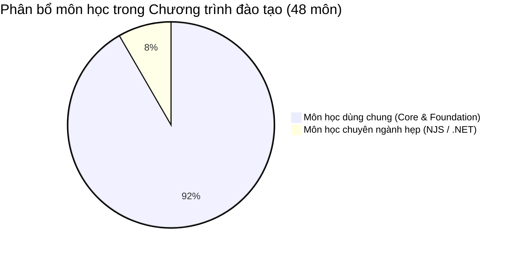

# BÁO CÁO PHÂN TÍCH & SO SÁNH CHƯƠNG TRÌNH ĐÀO TẠO
## 📌 Chuyên ngành hẹp Software Engineering: NodeJS vs .NET (Khóa 19B)

Báo cáo này cung cấp cái nhìn tổng quan, phân tích chi tiết các môn học giống và khác nhau, cùng với định hướng nghề nghiệp tương ứng giữa hai lộ trình chuyên ngành hẹp của ngành Kỹ nghệ Phần mềm (Software Engineering) tại Đại học FPT:
1. **Chuyên ngành hẹp NodeJS** (`BIT_SE_NJS_19B`)
2. **Chuyên ngành hẹp .NET** (`BIT_SE_NET_19B`)

---

## 📊 1. So sánh tổng quan (High-Level Comparison)

Chương trình đào tạo của cả hai chuyên ngành hẹp được thiết kế vô cùng chặt chẽ, tối ưu hóa thời gian học tập nhưng vẫn đảm bảo định hướng chuyên môn rõ rệt.



| Tiêu chí              | Lộ trình NodeJS (NJS)    | Lộ trình .NET (.NET)     |
| :----------------------| :-------------------------| :-------------------------|
| **Mã chuyên ngành**   | `BIT_SE_NJS_19B`         | `BIT_SE_NET_19B`         |
| **Tổng số môn học**   | **48 môn**               | **48 môn**               |
| **Số môn trùng khớp** | **44 môn** (Chiếm 91.7%) | **44 môn** (Chiếm 91.7%) |
| **Số môn đặc thù**    | **4 môn** (Chiếm 8.3%)   | **4 môn** (Chiếm 8.3%)   |
| **Phân bổ kỳ học**    | 9 Học kỳ + Kỳ dự bị      | 9 Học kỳ + Kỳ dự bị      |

> [!NOTE]
> Tất cả 44 môn dùng chung giữa hai chuyên ngành đều được sắp xếp học vào **cùng một học kỳ** giống hệt nhau, đảm bảo tính đồng bộ cao trong quá trình đào tạo nền tảng.

---

## 🔍 2. Phân tích chi tiết các môn học đặc thù (Specialized Subjects)

Sự khác biệt trong chương trình học của hai sinh viên xuất hiện tại các **Học kỳ 5, 7 và 8**. Đây là giai đoạn sinh viên bắt đầu tiếp cận trực tiếp các công nghệ cốt lõi của chuyên ngành hẹp đã chọn.

### 📋 Bảng đối chiếu môn học đặc thù

| Học kỳ | 💻 Chuyên ngành hẹp NodeJS (`BIT_SE_NJS_19B`) | 🏢 Chuyên ngành hẹp .NET (`BIT_SE_NET_19B`) |
| :---: | :--- | :--- |
| **Kỳ 5** | **Front-End web development with React** <br>*(Lập trình Front-End nâng cao với ReactJS)* | **BasicCross-Platform Application Programming With .NET** (`PRN212`) <br>*(Lập trình đa nền tảng cơ bản với .NET & C#)* |
| **Kỳ 7** | **Server-Side development with NodeJS, Express, and MongoDB** <br>*(Phát triển Backend với NodeJS, Express và MongoDB)* | **Advanced Cross-Platform Application Programming With .NET** (`PRN222`) <br>*(Lập trình đa nền tảng nâng cao với .NET)* |
| **Kỳ 7** | **Multiplatform Mobile App Development** <br>*(Lập trình ứng dụng di động đa nền tảng)* | **Game Programming with C#** (`PRU213`) <br>*(Lập trình Game bằng ngôn ngữ C#)* |
| **Kỳ 8** | **Web Development Project** <br>*(Đồ án/Dự án phát triển ứng dụng Web)* | **Building Cross-Platform Back-End Application With .NET** (`PRN232`) <br>*(Xây dựng ứng dụng Backend đa nền tảng với .NET)* |

---

## 🎯 3. Định hướng nghề nghiệp & Khác biệt cốt lõi

Lựa chọn chuyên ngành hẹp quyết định trực tiếp đến bộ kỹ năng (Skillsets) và cơ hội nghề nghiệp của sinh viên sau khi tốt nghiệp.

````carousel
```markdown
### 💻 Định hướng NodeJS (NJS)
**Fullstack JavaScript Developer**

- **Công nghệ chính:** JavaScript/TypeScript, ReactJS, NodeJS, ExpressJS, MongoDB, RESTful APIs.
- **Kỹ năng cốt lõi:**
  - Thiết kế và phát triển giao diện Web hiện đại, tương tác cao với React.
  - Xây dựng Backend linh hoạt, non-blocking I/O bằng NodeJS.
  - Làm việc với cơ sở dữ liệu NoSQL (MongoDB).
  - Lập trình ứng dụng di động đa nền tảng (React Native / Flutter).
- **Phù hợp với:** Các dự án Startup, công ty Product, các ứng dụng Web/Mobile thời gian thực (Real-time), ứng dụng SaaS quy mô linh hoạt.
```
<!-- slide -->
```markdown
### 🏢 Định hướng .NET (.NET)
**Enterprise & Game Developer (.NET/C#)**

- **Công nghệ chính:** C#, .NET Core/Framework, ASP.NET Web API, Entity Framework, Unity Game Engine.
- **Kỹ năng cốt lõi:**
  - Lập trình hướng đối tượng sâu sắc với C#.
  - Xây dựng ứng dụng doanh nghiệp (Enterprise App) có độ bảo mật và hiệu năng cực cao.
  - Phát triển Backend đa nền tảng mạnh mẽ với kiến trúc .NET Core.
  - Tiếp cận phát triển Game đa nền tảng (Mobile, PC, Console) sử dụng C# và Unity.
- **Phù hợp với:** Các tập đoàn công nghệ lớn (Enterprise), ngân hàng, tổ chức tài chính, công ty Outsource quy mô lớn, và các Studio phát triển Game.
```
````

---

## 🤝 4. Các môn học nền tảng dùng chung tiêu biểu (Core Subjects)

Dù đi theo chuyên ngành hẹp nào, sinh viên Software Engineering tại FPT vẫn được trang bị một nền tảng kỹ thuật cực kỳ vững chắc thông qua 44 môn dùng chung:

*   **Nhóm Cơ sở ngành:** Kỹ thuật lập trình cơ bản (PRF192), Lập trình hướng đối tượng (PRO192), Cấu trúc dữ liệu & Giải thuật (CSD201), Hệ điều hành (OSG202), Mạng máy tính (NWC204), Cơ sở dữ liệu (DBI202).
*   **Nhóm Kỹ nghệ phần mềm (Software Engineering Core):** Nhập môn kỹ nghệ phần mềm (SWE201c), Lấy yêu cầu phần mềm (SWR302), Kiểm thử phần mềm (SWT301), Thiết kế kiến trúc phần mềm (SWD392), Quản trị dự án (PMG201c).
*   **Dự án & Đồ án thực tế:** Dự án phát triển phần mềm (SWP391), Học tập thực tế tại doanh nghiệp (OJT202 - On the Job Training), và Đồ án tốt nghiệp (SEP490 - SE Capstone Project).

---

> [!TIP]
> **Khuyên dùng:** 
> * Nếu bạn yêu thích sự linh hoạt, các xu hướng công nghệ Web hiện đại, phát triển ứng dụng nhanh chóng (Agile/Scrum) -> **Lộ trình NodeJS** là lựa chọn tuyệt vời.
> * Nếu bạn ưa thích sự chặt chẽ của kiểu dữ liệu (Strongly-typed), muốn phát triển các hệ thống lớn cho ngân hàng/doanh nghiệp lớn, hoặc có đam mê phát triển Game -> **Lộ trình .NET** sẽ mở ra cơ hội rất lớn.
