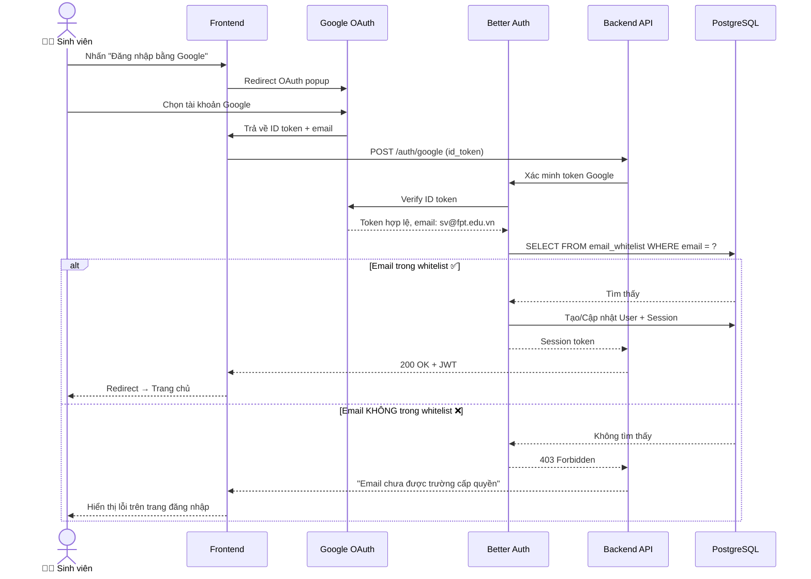
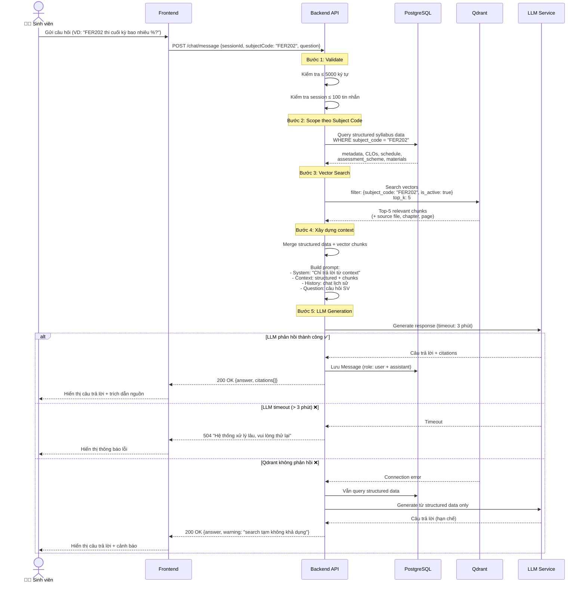
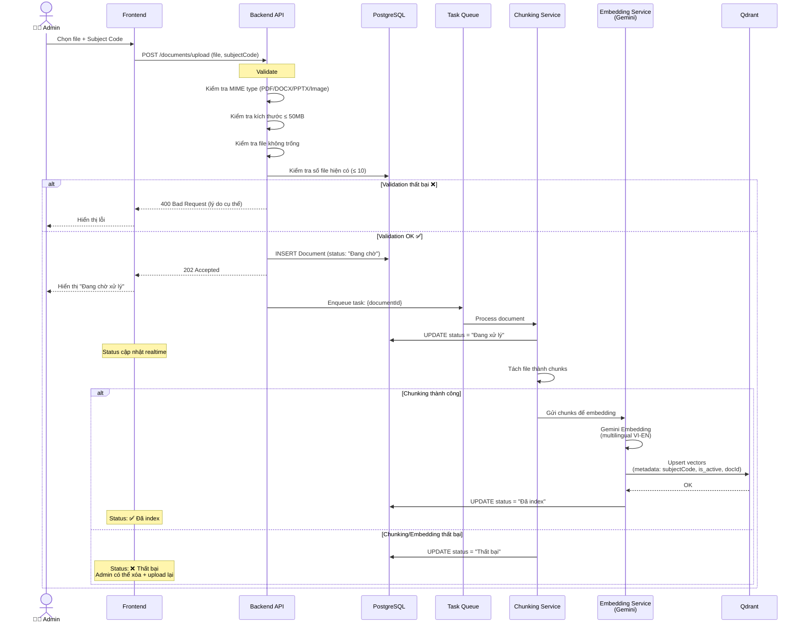
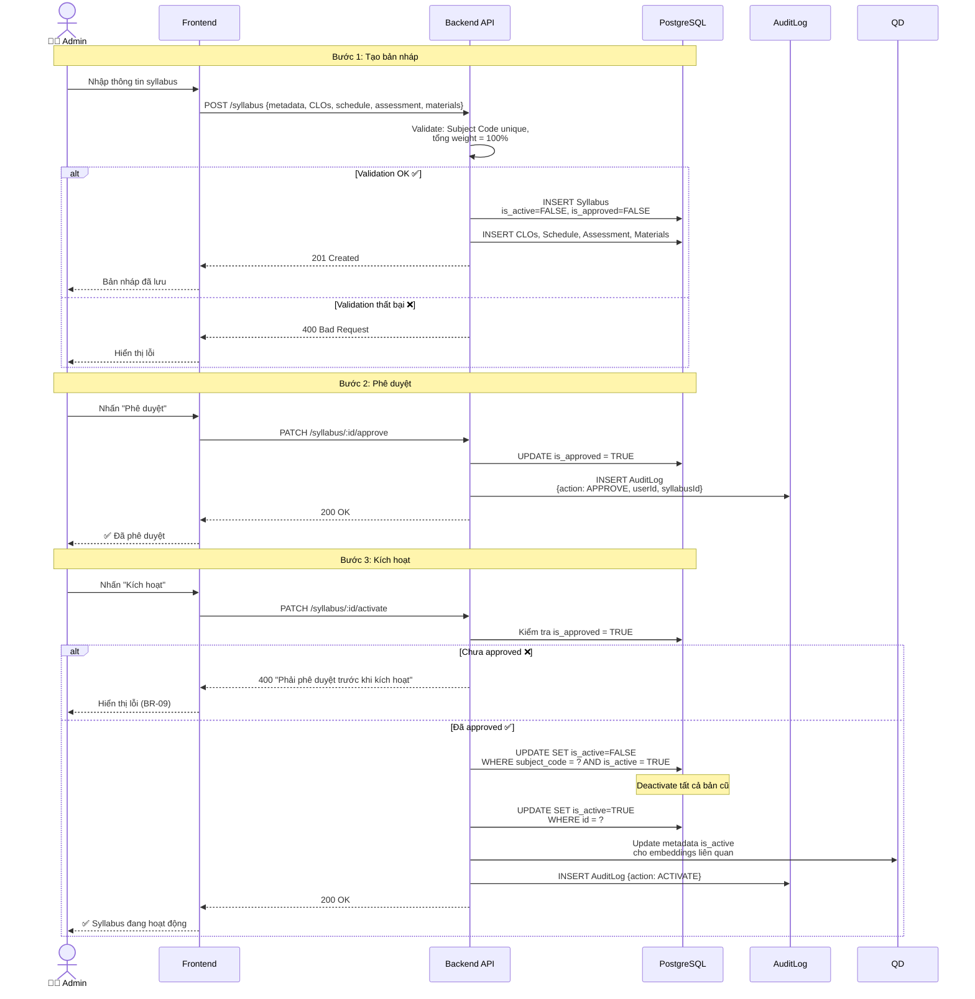
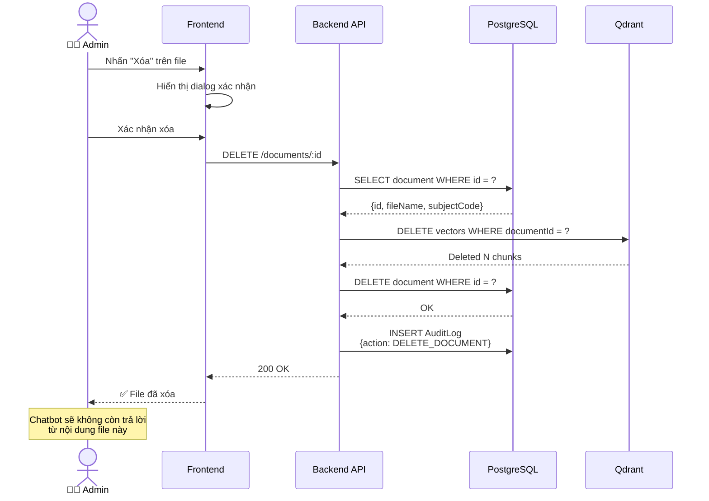
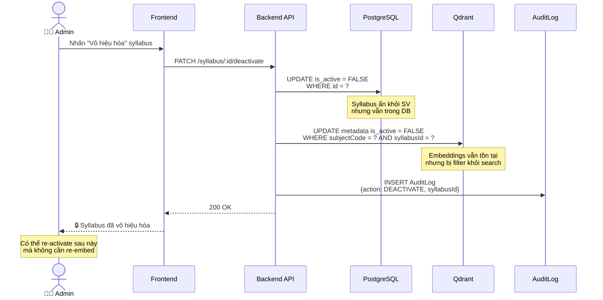
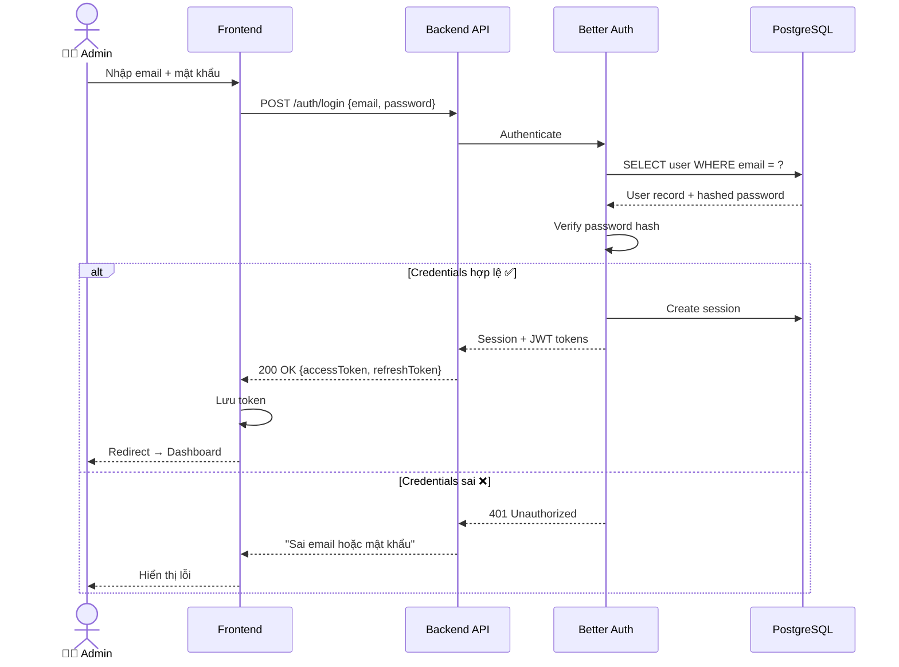
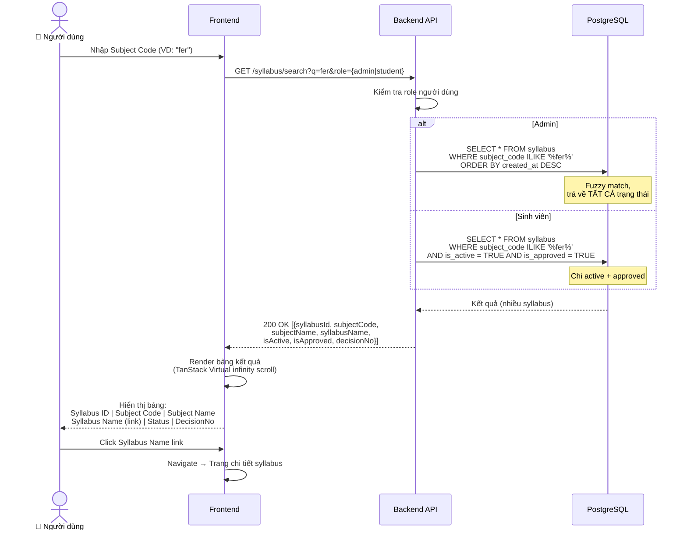

# Sequence Diagrams — RAG Chatbot & Mini FLM

> **Phiên bản:** 1.0 — 23/05/2026
> **Tham chiếu:** [SRS_Detailed.md](file:///e:/FPT/Semester_7/SDN302/srs/SRS_Detailed.md) | [User Flows](file:///e:/FPT/Semester_7/SDN302/srs/docs/user_flows.md)

---

## Mục Lục

1. [Đăng Nhập Sinh Viên (Google OAuth + Whitelist)](#1-đăng-nhập-sinh-viên-google-oauth--whitelist)
2. [Chatbot Hỏi Đáp (RAG Pipeline)](#2-chatbot-hỏi-đáp-rag-pipeline)
3. [Upload & Index Tài Liệu](#3-upload--index-tài-liệu)
4. [Tạo & Phê Duyệt Syllabus](#4-tạo--phê-duyệt-syllabus)
5. [Xóa Tài Liệu](#5-xóa-tài-liệu)
6. [Vô Hiệu Hóa Syllabus](#6-vô-hiệu-hóa-syllabus)
7. [Đăng Nhập Admin](#7-đăng-nhập-admin)
8. [Search Syllabus](#8-search-syllabus)

---

## 1. Đăng Nhập Sinh Viên (Google OAuth + Whitelist)

> **Actors:** Sinh viên, Google OAuth, Better Auth, Backend, PostgreSQL
> **Tham chiếu:** FR-07.2, EC-30

---

## 2. Chatbot Hỏi Đáp (RAG Pipeline)

> **Actors:** Sinh viên, Backend, PostgreSQL, Qdrant, LLM
> **Tham chiếu:** FR-04.3, FR-04.4, FR-06.1–FR-06.5, BR-06

---

## 3. Upload & Index Tài Liệu

> **Actors:** Admin, Backend, Queue, Qdrant
> **Tham chiếu:** FR-03.1–FR-03.5, EC-01–EC-07

---

## 4. Tạo & Phê Duyệt Syllabus

> **Actors:** Admin, Backend, PostgreSQL
> **Tham chiếu:** FR-02.1–FR-02.3, BR-09, BR-10

---

## 5. Xóa Tài Liệu

> **Actors:** Admin, Backend, PostgreSQL, Qdrant
> **Tham chiếu:** FR-03.7, BR-07

---

## 6. Vô Hiệu Hóa Syllabus

> **Actors:** Admin, Backend, PostgreSQL, Qdrant
> **Tham chiếu:** FR-02.5, BR-11, BR-19

---

## 7. Đăng Nhập Admin

> **Actors:** Admin, Better Auth, PostgreSQL
> **Tham chiếu:** FR-07.1

---

## 8. Search Syllabus

> **Actors:** Admin/Sinh viên, Backend, PostgreSQL
> **Tham chiếu:** FR-02.8, FR-02.9, GAP-05

---

## 9. Bảng Tổng Hợp Sequence Diagrams

| # | Diagram | Actors | FR/BR tham chiếu | Phức tạp |
|---|---|---|---|---|
| 1 | Đăng nhập SV (Google OAuth) | SV, Google, Better Auth, DB | FR-07.2, EC-30 | Trung bình |
| 2 | Chatbot RAG Pipeline | SV, BE, DB, Qdrant, LLM | FR-04, FR-06, BR-06 | **Cao** |
| 3 | Upload & Index tài liệu | Admin, BE, Queue, Qdrant | FR-03, EC-01→EC-10 | Cao |
| 4 | Tạo & Phê duyệt syllabus | Admin, BE, DB | FR-02.1→02.3, BR-09→10 | Trung bình |
| 5 | Xóa tài liệu | Admin, BE, DB, Qdrant | FR-03.7, BR-07 | Thấp |
| 6 | Vô hiệu hóa syllabus | Admin, BE, DB, Qdrant | FR-02.5, BR-11, BR-19 | Thấp |
| 7 | Đăng nhập Admin | Admin, Better Auth, DB | FR-07.1 | Thấp |
| 8 | Search syllabus | Admin/SV, BE, DB | FR-02.8, FR-02.9 | Trung bình |
