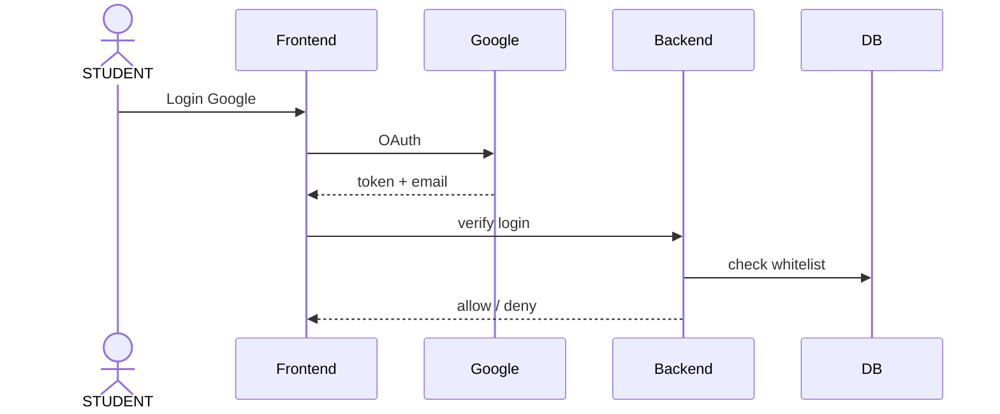
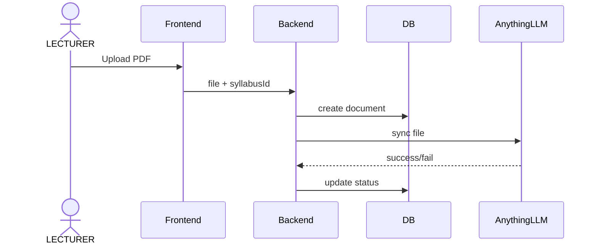
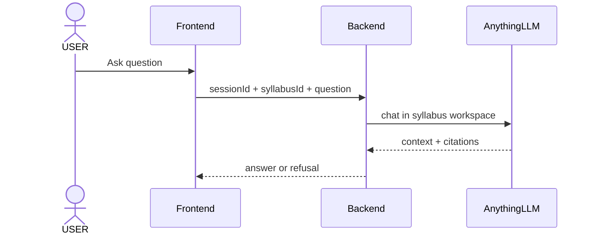
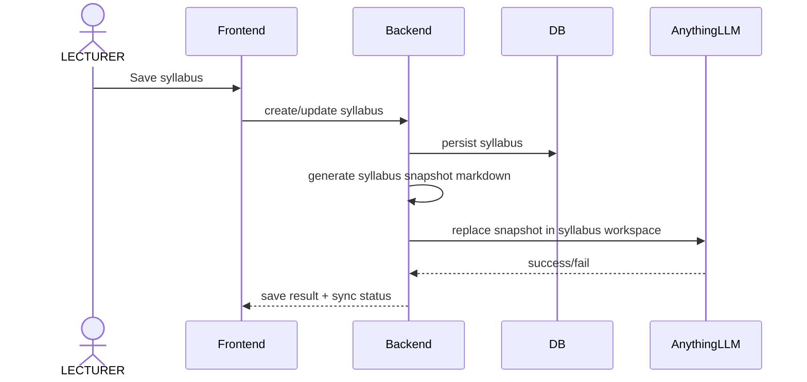
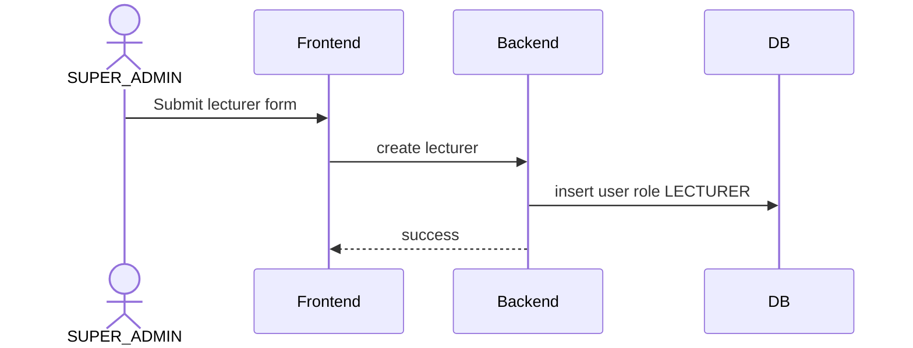

# Sequence Diagrams

> Phiên bản: 1.0  
> Cập nhật: 2026-06-23

## Student Login

```mermaid
sequenceDiagram
    actor ST as STUDENT
    participant FE as Frontend
    participant GO as Google
    participant BE as Backend
    participant DB as DB

    ST->>FE: Login Google
    FE->>GO: OAuth
    GO-->>FE: token + email
    FE->>BE: verify login
    BE->>DB: check whitelist
    BE-->>FE: allow / deny
```

## Upload PDF

```mermaid
sequenceDiagram
    actor LE as LECTURER
    participant FE as Frontend
    participant BE as Backend
    participant DB as DB
    participant AL as AnythingLLM

    LE->>FE: Upload PDF
    FE->>BE: file + syllabusId
    BE->>DB: create document
    BE->>AL: sync file
    AL-->>BE: success/fail
    BE->>DB: update status
```

## Course Chat

```mermaid
sequenceDiagram
    actor US as USER
    participant FE as Frontend
    participant BE as Backend
    participant AL as AnythingLLM

    US->>FE: Ask question
    FE->>BE: sessionId + syllabusId + question
    BE->>AL: chat in syllabus workspace
    AL-->>BE: context + citations
    BE-->>FE: answer or refusal
```

## Sync Syllabus Snapshot

```mermaid
sequenceDiagram
    actor LE as LECTURER
    participant FE as Frontend
    participant BE as Backend
    participant DB as DB
    participant AL as AnythingLLM

    LE->>FE: Save syllabus
    FE->>BE: create/update syllabus
    BE->>DB: persist syllabus
    BE->>BE: generate syllabus snapshot markdown
    BE->>AL: replace snapshot in syllabus workspace
    AL-->>BE: success/fail
    BE-->>FE: save result + sync status
```

## Create Lecturer

```mermaid
sequenceDiagram
    actor SA as SUPER_ADMIN
    participant FE as Frontend
    participant BE as Backend
    participant DB as DB

    SA->>FE: Submit lecturer form
    FE->>BE: create lecturer
    BE->>DB: insert user role LECTURER
    BE-->>FE: success
```
