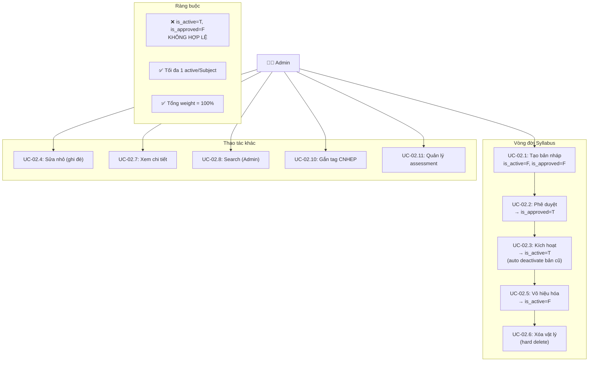
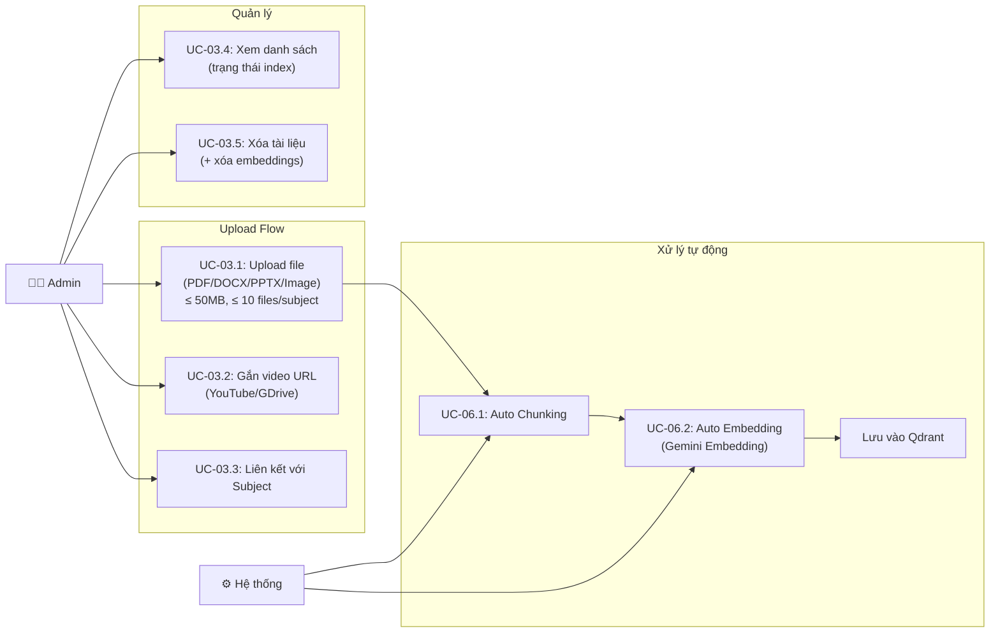
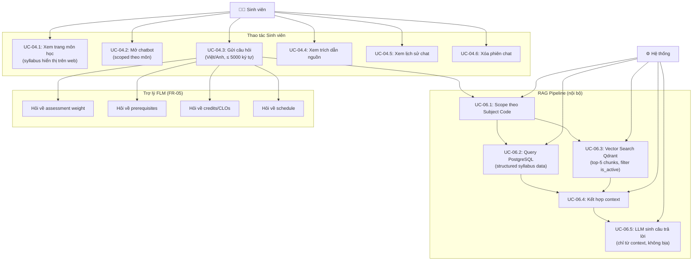
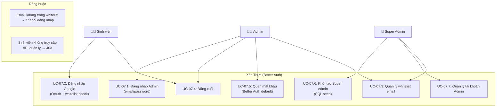

# Use Case Diagrams — RAG Chatbot & Mini FLM

> **Phiên bản:** 1.0 — 23/05/2026
> **Tham chiếu:** [SRS_Detailed.md](file:///e:/FPT/Semester_7/SDN302/srs/SRS_Detailed.md)

---

## 1. Tổng Quan Hệ Thống (System-Level Use Case)

```mermaid
graph TB
    subgraph Actors
        SA["🔑 Super Admin"]
        AD["👨‍💼 Admin"]
        SV["👨‍🎓 Sinh viên"]
        SYS["⚙️ Hệ thống"]
    end

    subgraph UC_Auth["FR-07: Xác Thực & Phân Quyền"]
        UC71["UC-07.1: Đăng nhập Admin"]
        UC72["UC-07.2: Đăng nhập Google OAuth"]
        UC73["UC-07.3: Quản lý whitelist email"]
        UC74["UC-07.4: Khởi tạo Super Admin"]
        UC75["UC-07.5: Quản lý tài khoản Admin"]
    end

    subgraph UC_Curriculum["FR-01: Quản Lý Ngành & CNHEP"]
        UC11["UC-01.1: CRUD Ngành"]
        UC12["UC-01.2: CRUD Chuyên ngành hẹp"]
        UC13["UC-01.3: CRUD Chương trình ĐT"]
        UC14["UC-01.4: Gán môn đặc thù"]
    end

    subgraph UC_Syllabus["FR-02: Quản Lý Syllabus"]
        UC21["UC-02.1: Tạo syllabus (bản nháp)"]
        UC22["UC-02.2: Phê duyệt syllabus"]
        UC23["UC-02.3: Kích hoạt syllabus"]
        UC24["UC-02.4: Cập nhật syllabus"]
        UC25["UC-02.5: Vô hiệu hóa syllabus"]
        UC26["UC-02.6: Xóa syllabus (hard delete)"]
        UC27["UC-02.7: Xem chi tiết syllabus"]
        UC28["UC-02.8: Search syllabus (Admin)"]
        UC29["UC-02.9: Search syllabus (SV)"]
        UC210["UC-02.10: Gắn tag CNHEP"]
        UC211["UC-02.11: Quản lý assessment"]
    end

    subgraph UC_Doc["FR-03: Upload & Xử Lý Tài Liệu"]
        UC31["UC-03.1: Upload file"]
        UC32["UC-03.2: Gắn video URL"]
        UC33["UC-03.3: Liên kết file với môn"]
        UC34["UC-03.4: Xem danh sách tài liệu"]
        UC35["UC-03.5: Xóa tài liệu"]
    end

    subgraph UC_Chat["FR-04: Chatbot & FLM"]
        UC41["UC-04.1: Xem trang môn học"]
        UC42["UC-04.2: Tạo phiên chat"]
        UC43["UC-04.3: Gửi câu hỏi"]
        UC44["UC-04.4: Xem trích dẫn nguồn"]
        UC45["UC-04.5: Xem lịch sử chat"]
        UC46["UC-04.6: Xóa phiên chat"]
    end

    subgraph UC_RAG["FR-06: RAG (Nội bộ)"]
        UC61["UC-06.1: Auto Chunking"]
        UC62["UC-06.2: Auto Embedding"]
        UC63["UC-06.3: Vector Search"]
        UC64["UC-06.4: LLM Generation"]
    end

    SA --> UC74
    SA --> UC75
    SA --> UC73
    SA --> UC11
    SA --> UC12
    SA --> UC13

    AD --> UC71
    AD --> UC11
    AD --> UC12
    AD --> UC13
    AD --> UC14
    AD --> UC21
    AD --> UC22
    AD --> UC23
    AD --> UC24
    AD --> UC25
    AD --> UC26
    AD --> UC28
    AD --> UC210
    AD --> UC211
    AD --> UC31
    AD --> UC32
    AD --> UC33
    AD --> UC34
    AD --> UC35

    SV --> UC72
    SV --> UC29
    SV --> UC41
    SV --> UC42
    SV --> UC43
    SV --> UC44
    SV --> UC45
    SV --> UC46
    SV --> UC27

    SYS --> UC61
    SYS --> UC62
    SYS --> UC63
    SYS --> UC64
```

---

## 2. Use Case Chi Tiết: Quản Lý Syllabus (FR-02)

---

## 3. Use Case Chi Tiết: Upload & Xử Lý Tài Liệu (FR-03)

---

## 4. Use Case Chi Tiết: Chatbot Hỏi Đáp (FR-04 + FR-05 + FR-06)

---

## 5. Use Case Chi Tiết: Xác Thực (FR-07)

---

## 6. Bảng Tóm Tắt Use Case

| Use Case ID | Tên | Actor chính | FR tham chiếu |
|---|---|---|---|
| UC-01.1 | CRUD Ngành | Admin | FR-01.1 |
| UC-01.2 | CRUD Chuyên ngành hẹp | Admin | FR-01.2 |
| UC-01.3 | CRUD Chương trình đào tạo | Admin | FR-01.3 |
| UC-01.4 | Gán môn đặc thù | Admin | FR-01.4 |
| UC-02.1 | Tạo syllabus (bản nháp) | Admin | FR-02.1 |
| UC-02.2 | Phê duyệt syllabus | Admin | FR-02.2 |
| UC-02.3 | Kích hoạt syllabus | Admin | FR-02.3 |
| UC-02.4 | Cập nhật syllabus (sửa nhỏ) | Admin | FR-02.4 |
| UC-02.5 | Vô hiệu hóa syllabus | Admin | FR-02.5 |
| UC-02.6 | Xóa syllabus (hard delete) | Admin | FR-02.6 |
| UC-02.7 | Xem chi tiết syllabus | Admin, Sinh viên | FR-02.7 |
| UC-02.8 | Search syllabus (Admin) | Admin | FR-02.8 |
| UC-02.9 | Search syllabus (Sinh viên) | Sinh viên | FR-02.9 |
| UC-02.10 | Gắn tag chuyên ngành hẹp | Admin | FR-02.10 |
| UC-02.11 | Quản lý assessment scheme | Admin | FR-02.11 |
| UC-03.1 | Upload file | Admin | FR-03.1 |
| UC-03.2 | Gắn video URL | Admin | FR-03.2 |
| UC-03.3 | Liên kết file với môn | Admin | FR-03.3 |
| UC-03.4 | Xem danh sách tài liệu | Admin | FR-03.6 |
| UC-03.5 | Xóa tài liệu | Admin | FR-03.7 |
| UC-04.1 | Xem trang môn học | Sinh viên | FR-04.1 |
| UC-04.2 | Tạo phiên chat | Sinh viên | FR-04.2 |
| UC-04.3 | Gửi câu hỏi | Sinh viên | FR-04.3 |
| UC-04.4 | Xem trích dẫn nguồn | Sinh viên | FR-04.6 |
| UC-04.5 | Xem lịch sử chat | Sinh viên | FR-04.7 |
| UC-04.6 | Xóa phiên chat | Sinh viên | FR-04.8 |
| UC-07.1 | Đăng nhập Admin | Admin | FR-07.1 |
| UC-07.2 | Đăng nhập Google OAuth | Sinh viên | FR-07.2 |
| UC-07.3 | Quản lý whitelist email | Super Admin | FR-07.3 |
| UC-07.4 | Đăng xuất | Tất cả | FR-07.4 |
| UC-07.5 | Quên mật khẩu | Admin | FR-07.5 |
| UC-07.6 | Khởi tạo Super Admin | Super Admin | FR-07.6 |
| UC-07.7 | Quản lý tài khoản Admin | Super Admin | FR-07.7 |
