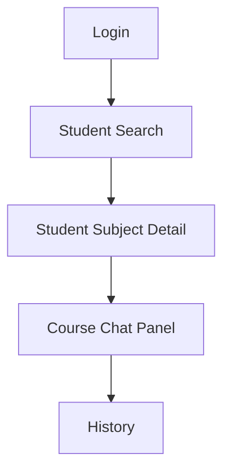
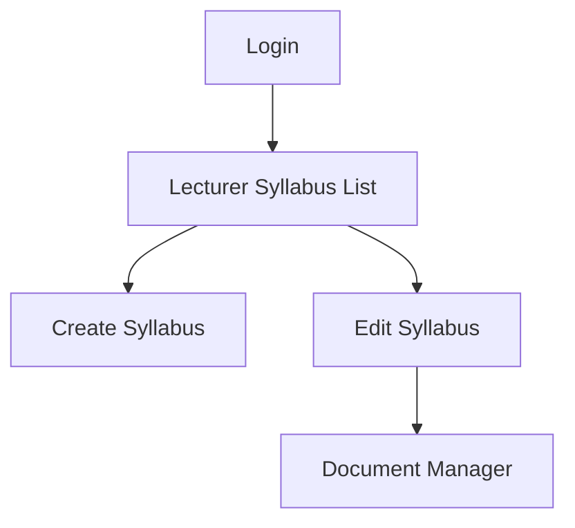
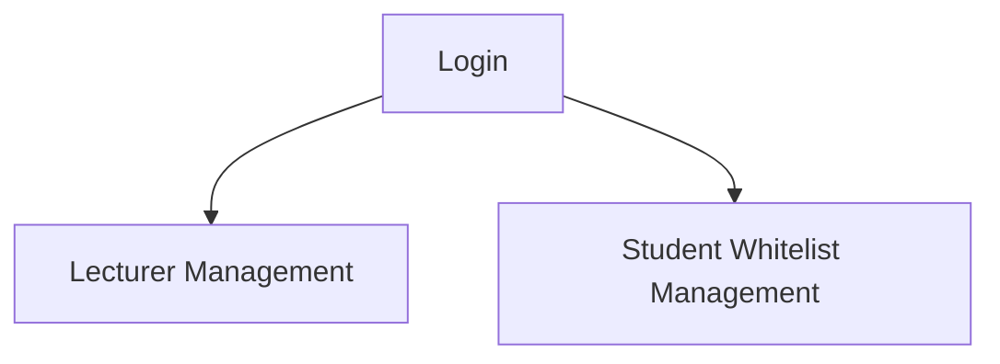

# User Flows

> Phiên bản: 1.0  
> Cập nhật: 2026-06-23

## Student

## Lecturer

## Super Admin

## Notes

- Chat chỉ đi từ `Student Subject Detail`
- `Document Manager` chỉ cho `PDF`
- Không có flow `lecturer request`
