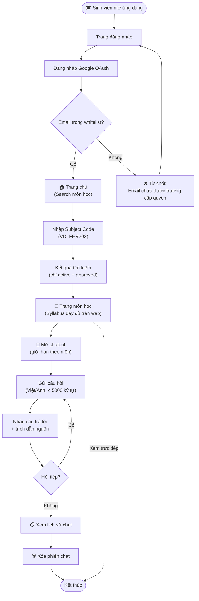
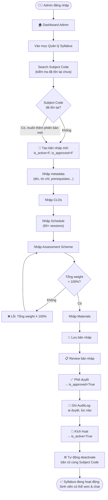
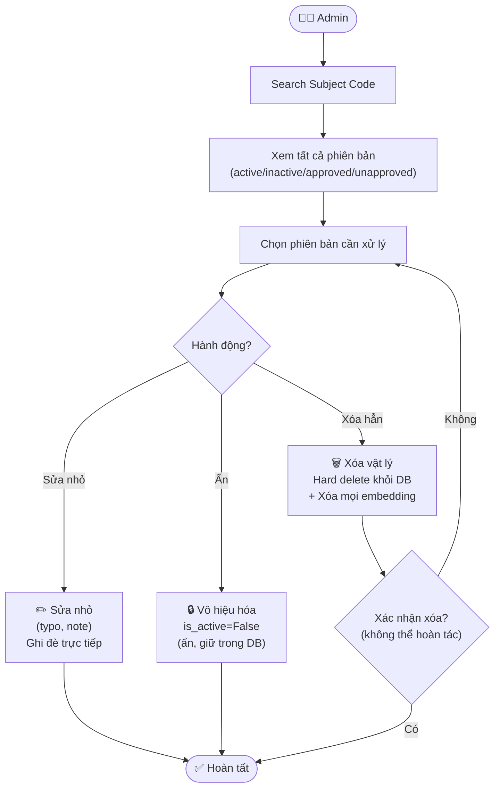
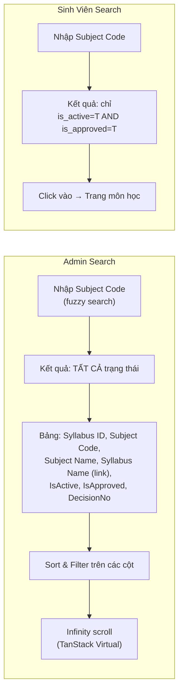
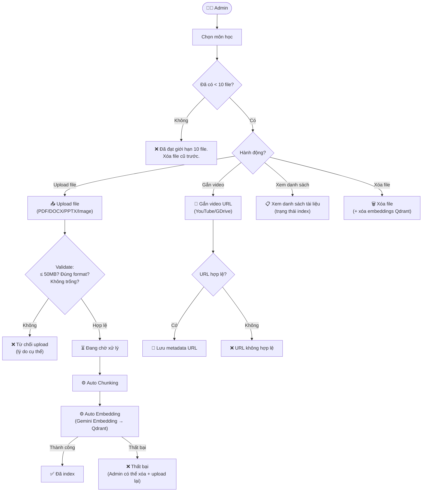
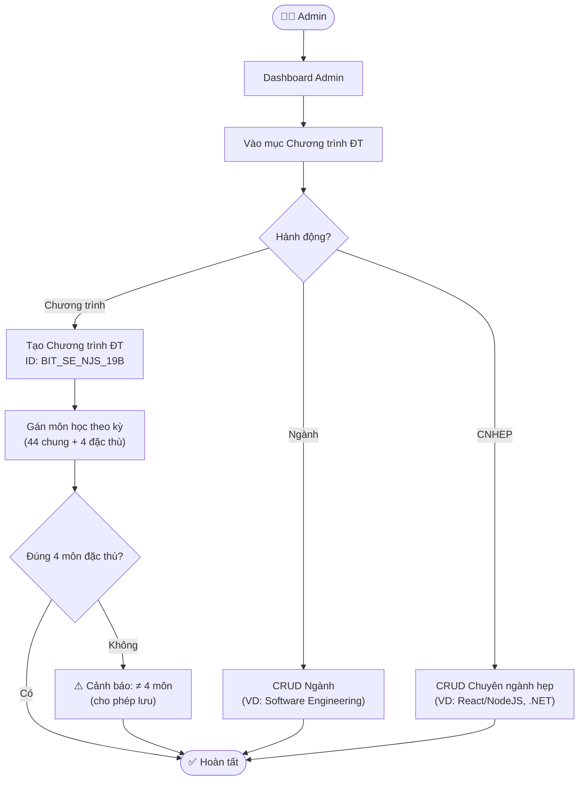
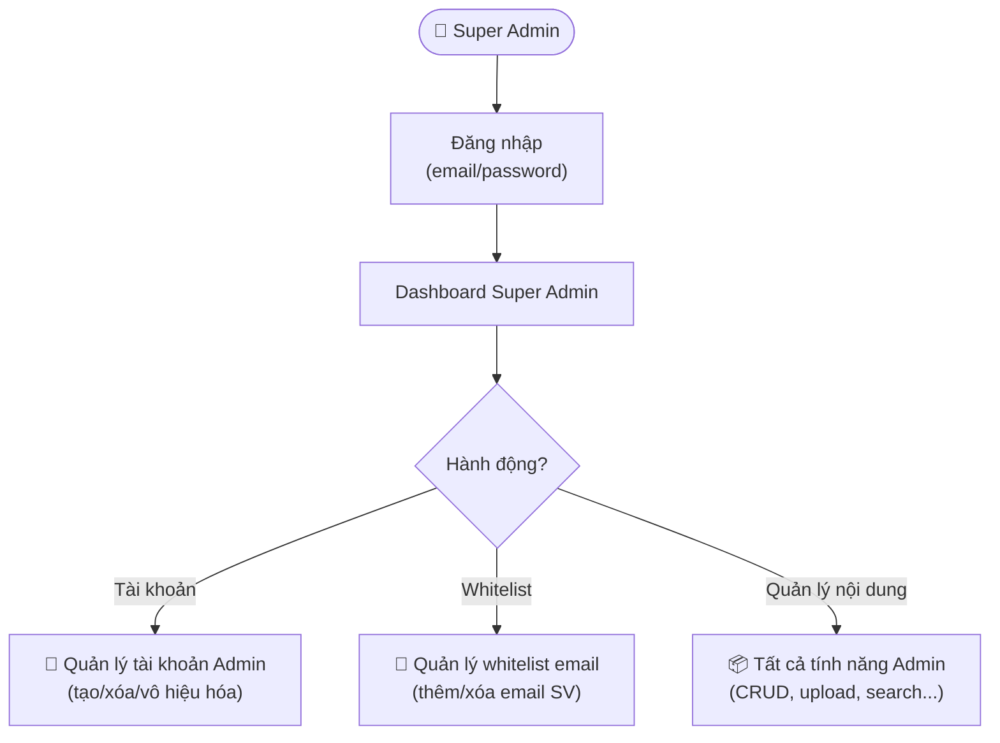
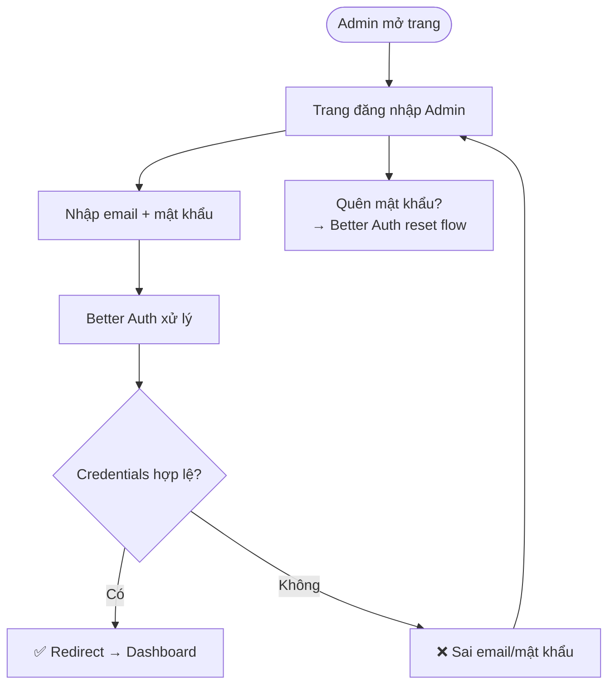
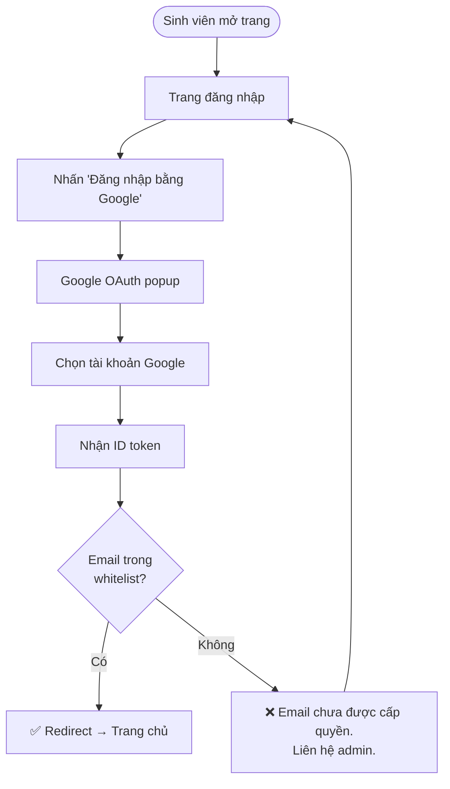

# User Flows — RAG Chatbot & Mini FLM

> **Phiên bản:** 1.0 — 23/05/2026
> **Tham chiếu:** [SRS_Detailed.md](file:///e:/FPT/Semester_7/SDN302/srs/SRS_Detailed.md) | [Use Case Diagrams](file:///e:/FPT/Semester_7/SDN302/srs/docs/use_case_diagrams.md)

---

## Mục Lục

1. [Luồng Sinh Viên: Đăng Nhập & Hỏi Đáp](#1-luồng-sinh-viên-đăng-nhập--hỏi-đáp)
2. [Luồng Admin: Quản Lý Syllabus](#2-luồng-admin-quản-lý-syllabus)
3. [Luồng Admin: Upload & Xử Lý Tài Liệu](#3-luồng-admin-upload--xử-lý-tài-liệu)
4. [Luồng Admin: Quản Lý Chương Trình Đào Tạo](#4-luồng-admin-quản-lý-chương-trình-đào-tạo)
5. [Luồng Super Admin: Quản Lý Tài Khoản](#5-luồng-super-admin-quản-lý-tài-khoản)
6. [Luồng Xác Thực (Auth)](#6-luồng-xác-thực-auth)

---

## 1. Luồng Sinh Viên: Đăng Nhập & Hỏi Đáp

### 1.1 Tổng quan luồng chính

### 1.2 Chi tiết từng bước

| Bước | Hành động | Màn hình / Component | Ghi chú |
|---|---|---|---|
| 1 | Sinh viên truy cập ứng dụng | Trang đăng nhập | Nút "Đăng nhập bằng Google" |
| 2 | Nhấn đăng nhập Google | Google OAuth popup | Better Auth xử lý |
| 3 | Hệ thống kiểm tra email whitelist | — (backend) | Email không trong whitelist → thông báo lỗi |
| 4 | Đăng nhập thành công → Trang chủ | Trang chủ | Thanh search Subject Code |
| 5 | Nhập Subject Code (VD: "FER202") | Thanh search | Chỉ hiện kết quả `is_active=True AND is_approved=True` |
| 6 | Nhấn chọn môn từ kết quả | Trang môn học | Hiển thị syllabus đầy đủ (scrollable) |
| 7 | Nhấn nút "Hỏi đáp" / mở chatbot | Panel chatbot bên phải | Giới hạn scope trong môn đang xem |
| 8 | Gõ câu hỏi, gửi | Input chat | ≤ 5.000 ký tự |
| 9 | Chờ phản hồi | Loading indicator | Timeout: 3 phút |
| 10 | Đọc câu trả lời + trích dẫn | Bubble chat + citations block | Click trích dẫn xem chi tiết |
| 11 | Tiếp tục hỏi hoặc kết thúc | Chat input / nút đóng | ≤ 100 tin nhắn/phiên |

---

## 2. Luồng Admin: Quản Lý Syllabus

### 2.1 Tạo & Phê Duyệt Syllabus Mới

### 2.2 Sửa & Vô Hiệu Hóa Syllabus

### 2.3 Search Syllabus (Admin vs Sinh Viên)

---

## 3. Luồng Admin: Upload & Xử Lý Tài Liệu

---

## 4. Luồng Admin: Quản Lý Chương Trình Đào Tạo

---

## 5. Luồng Super Admin: Quản Lý Tài Khoản

---

## 6. Luồng Xác Thực (Auth)

### 6.1 Đăng Nhập Admin

### 6.2 Đăng Nhập Sinh Viên (Google OAuth)

---

## 7. Bảng Tham Chiếu Luồng ↔ Use Case ↔ FR

| Luồng | Use Case | FR | Actor |
|---|---|---|---|
| 1 — SV đăng nhập & hỏi đáp | UC-07.2, UC-04.1→UC-04.6 | FR-07.2, FR-04.1→FR-04.8 | Sinh viên |
| 2.1 — Tạo & phê duyệt syllabus | UC-02.1→UC-02.3 | FR-02.1→FR-02.3 | Admin |
| 2.2 — Sửa & vô hiệu hóa | UC-02.4→UC-02.6 | FR-02.4→FR-02.6 | Admin |
| 2.3 — Search syllabus | UC-02.8, UC-02.9 | FR-02.8, FR-02.9 | Admin, SV |
| 3 — Upload tài liệu | UC-03.1→UC-03.5 | FR-03.1→FR-03.8 | Admin |
| 4 — Chương trình ĐT | UC-01.1→UC-01.4 | FR-01.1→FR-01.5 | Admin |
| 5 — Quản lý tài khoản | UC-07.3, UC-07.6, UC-07.7 | FR-07.3→FR-07.7 | Super Admin |
| 6 — Auth | UC-07.1, UC-07.2 | FR-07.1→FR-07.5 | Admin, SV |
