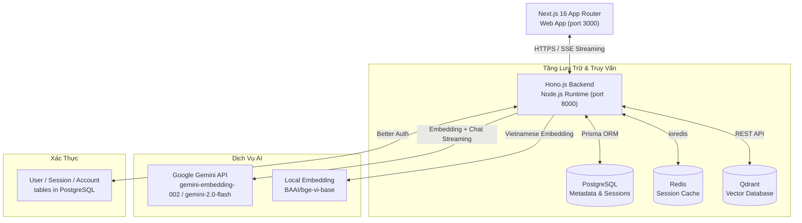
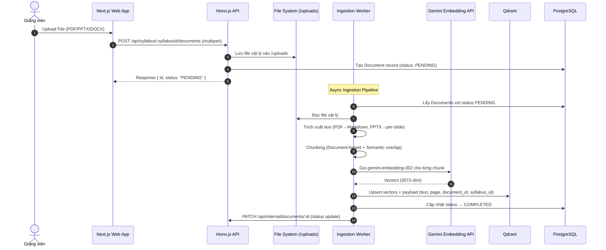
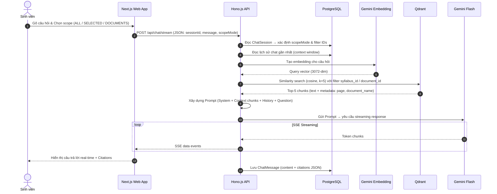

# TÀI LIỆU THIẾT KẾ KIẾN TRÚC & KỸ THUẬT (TECHNICAL & ARCHITECTURE DESIGN)

Tài liệu này trình bày thiết kế kiến trúc hệ thống, luồng dữ liệu chi tiết, đặc tả API chính và cấu trúc cơ sở dữ liệu của hệ thống **FPTU Chatbot RAG**.

---

## 1. Kiến Trúc Tổng Thể (System Architecture)

Hệ thống được xây dựng theo mô hình **Monorepo Client-Server**, phân tách rõ ràng giữa lớp giao diện (Frontend) và lớp nghiệp vụ (Backend API), quản lý bởi **Turborepo**.



### 1.1 Frontend (Next.js 16)
* **Công nghệ:** **Next.js 16.2 (App Router)**, **TypeScript**, **Mantine UI v9**, **Tailwind CSS v4**.
* **Đặc điểm:**
  * Sử dụng Mantine UI thay cho shadcn/ui — component library đầy đủ với form, modals, notifications.
  * `AuthContext.tsx` quản lý trạng thái đăng nhập và role routing (`/student`, `/teacher`, `/superadmin`).
  * `ChatbotWidget.tsx` nhận SSE stream từ `/api/chat/stream`.
  * `ProtectedRoute.tsx` bảo vệ các trang yêu cầu xác thực.
* **Structure:**
  * `/login` — trang đăng nhập
  * `/student` — Student dashboard + Syllabus viewer
  * `/teacher` — Teacher docs, curriculum, syllabus, users management
  * `/superadmin` — Superadmin whitelist + user management

### 1.2 Backend (Hono.js)
* **Công nghệ:** **Hono.js 4.12**, **TypeScript**, **Node.js** với `tsx watch` cho dev.
* **Đặc điểm:**
  * CORS cấu hình để reflect origin (phù hợp dev với nhiều port).
  * Swagger UI tự động sinh từ `openApiDoc` tại `/api/docs`.
  * Tất cả routes được mount trong `api/src/index.ts` với mô-đun `Hono` riêng biệt.
  * File uploads phục vụ static từ `/uploads/*`.

### 1.3 Tầng Dữ Liệu
* **PostgreSQL + Prisma ORM:** Lưu trữ toàn bộ domain data (curriculum, syllabus, users, chat history).
* **Redis (ioredis):** Cache session data cho Better Auth, tăng tốc auth check.
* **Qdrant:** Vector DB cho chunks tài liệu — filtering theo `syllabus_id` để cô lập dữ liệu.

---

## 2. Luồng Dữ Liệu Chi Tiết (Data Flows)

### 2.1 Luồng Upload & Index Tài Liệu (Document Ingestion Pipeline)



### 2.2 Luồng Chat & Hỏi Đáp RAG (Chat Flow)



---

## 3. Pipeline Xử Lý Đa Phương Thức (Multimodal Processing)

* **Video bài giảng:** Hệ thống lưu `VideoLink` kèm `url`, `title`, `description` (không chunk). Kế hoạch tích hợp Gemini multimodal embedding cho video ≤ 120 giây.
* **PDF/PPTX:** Trích xuất per-page / per-slide thành markdown, áp dụng chunking với overlap 50-100 tokens.
* **Images:** Dự kiến OCR + Gemini Vision để sinh mô tả text từ ảnh sơ đồ.

---

## 4. Thiết Kế Cơ Sở Dữ Liệu (Database Schema Design)

Schema được thiết kế đặc thù cho cấu trúc học thuật FPT University với **21 models**.

### 4.1 Domain Hierarchy (FPTU Academic Structure)

```
Major (SE, AI, BIT...)
  └── Specialization (NJS, NET, FE...)
        └── Curriculum (BIT_SE_NJS_19B)
              └── CurriculumSubject (semesterNo, isSpecializationSpecific)
                    └── Course (SDN302, FER202)
                          └── Syllabus (phiên bản 1 môn, isApproved, isActive)
                                ├── SyllabusClo         (CLO1, CLO2...)
                                ├── SyllabusSchedule    (60 buổi học)
                                ├── AssessmentScheme    (phân bổ điểm)
                                ├── SyllabusMaterial    (học liệu)
                                ├── ConstructiveQuestion (câu hỏi Edunext)
                                ├── SyllabusReference   (tài liệu tham khảo)
                                ├── VideoLink           (video bài giảng)
                                └── Document            (file upload → Qdrant)
```

### 4.2 Chat Models

```
ChatSession (scopeMode: ALL_COURSES | SELECTED_COURSES | SELECTED_DOCUMENTS)
  ├── ChatSessionCourse    (scoped to specific courses)
  ├── ChatSessionDocument  (scoped to specific documents)
  └── ChatMessage          (sender: USER | ASSISTANT, citations: Json?)
```

### 4.3 Auth & Admin Models (Better Auth)

```
User (id, email, role: ADMIN|LECTURER|STUDENT, banned)
  ├── Session (token, expiresAt, ipAddress)
  ├── Account (providerId, accessToken)
  └── AuditLog (action, entityType, entityId, details)

EmailWhitelist    (email — chỉ email này mới được đăng ký)
LecturerRequest   (email, reason, status: PENDING|APPROVED|REJECTED)
Verification      (identifier, value, expiresAt)
```

---

## 5. Bảo Mật & Data Integrity

### 5.1 Authentication Flow
1. User POST `/api/auth/sign-up/email` → Better Auth kiểm tra `EmailWhitelist`
2. Login tạo `Session` trong PostgreSQL + cache Redis
3. Mọi request protected phải có cookie session hợp lệ
4. Middleware Better Auth validate session và inject `user` vào context

### 5.2 Data Integrity Rules
- **Cascade Delete:** Xóa `Syllabus` → cascade xóa toàn bộ `Document`, `SyllabusSchedule`, `SyllabusClo`...
- **Vector Sync:** Xóa `Document` phải đồng bộ xóa vectors trong Qdrant trước
- **Active Syllabus:** Chỉ có thể có 1 Syllabus `isActive=true` trên 1 Course tại một thời điểm
- **Role Check:** Mọi mutating operation phải kiểm tra `user.role` trước khi thực thi

---

> [!IMPORTANT]
> **Lưu ý Cô Lập Dữ Liệu:** Mọi query tìm kiếm vector trên Qdrant bắt buộc phải kèm filter theo `syllabus_id` hoặc `document_id` từ danh sách được phép của user hiện tại. Không được query "toàn bộ collection" mà không có filter.

---

> **Last Updated:** 2026-06-05
> **Version:** 2.0
