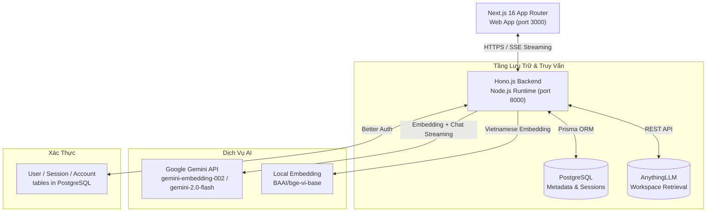
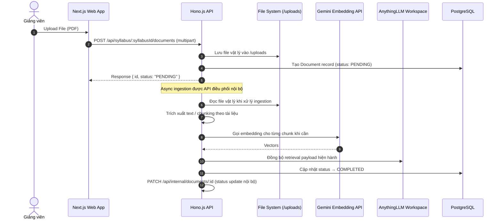
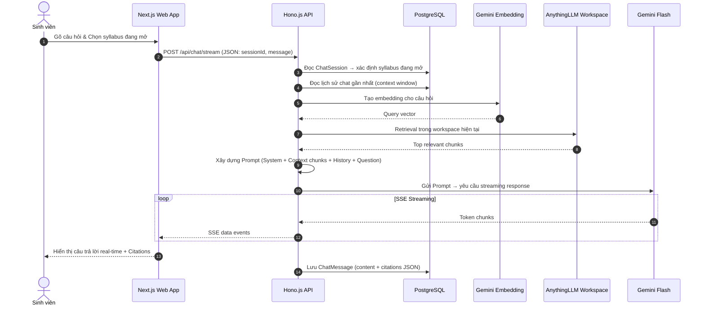

# TÀI LIỆU THIẾT KẾ KIẾN TRÚC & KỸ THUẬT (TECHNICAL & ARCHITECTURE DESIGN)

> Status: Current
> Audience: Developer
> Canonical: Yes
> Owner: Technical

Tài liệu này trình bày thiết kế kiến trúc kỹ thuật hiện tại của hệ thống **FPTU Chatbot RAG**.

> [!IMPORTANT]
> Đây là tài liệu kỹ thuật, không phải source of truth nghiệp vụ.

---

## 1. Kiến Trúc Tổng Thể (System Architecture)

Hệ thống được xây dựng theo mô hình **Monorepo Client-Server**, phân tách rõ ràng giữa lớp giao diện (Frontend) và lớp nghiệp vụ (Backend API), quản lý bởi **Turborepo**.



### 1.1 Frontend (Next.js 16)
* **Công nghệ:** **Next.js App Router**, **TypeScript**, **Mantine UI**, **Tailwind CSS**.
* **Đặc điểm:**
  * Sử dụng Mantine UI thay cho shadcn/ui — component library đầy đủ với form, modals, notifications.
  * `AuthContext.tsx` quản lý trạng thái đăng nhập và role routing (`/student`, `/teacher`, `/superadmin`).
  * `ChatbotWidget.tsx` nhận SSE stream từ `/api/chat/stream`.
  * `ProtectedRoute.tsx` bảo vệ các trang yêu cầu xác thực.
* **Structure:**
  * `/login` — trang đăng nhập
  * `/student` — Student dashboard + Syllabus viewer
  * `/teacher` — Teacher docs, curriculum, syllabus, users management
  * `/superadmin` — Superadmin whitelist + user management

### 1.2 Backend (Hono.js)
* **Công nghệ:** **Hono.js**, **TypeScript**, **Node.js**.
* **Đặc điểm:**
  * CORS cấu hình để reflect origin (phù hợp dev với nhiều port).
  * Swagger UI tự động sinh từ `openApiDoc` tại `/api/docs`.
  * Tất cả routes được mount trong `api/src/index.ts` với mô-đun `Hono` riêng biệt.
  * File uploads phục vụ static từ `/uploads/*`.

### 1.3 Tầng Dữ Liệu
* **PostgreSQL + Prisma ORM:** Lưu trữ domain data (curriculum, syllabus, users, chat history).
* **AnythingLLM:** Workspace retrieval cho syllabus-scoped chat.

---

## 2. Luồng Dữ Liệu Chi Tiết (Data Flows)

### 2.1 Luồng Upload & Index Tài Liệu (Document Ingestion Pipeline)



### 2.2 Luồng Chat & Hỏi Đáp RAG (Chat Flow)



---

## 3. Pipeline Xử Lý Đa Phương Thức (Multimodal Processing)

* **Video / images / other formats:** không thuộc Release A.
* **PDF:** nguồn chính cho ingestion.

---

## 4. Thiết Kế Cơ Sở Dữ Liệu (Database Schema Design)

Schema được thiết kế đặc thù cho cấu trúc học thuật FPT University với **21 models**.

### 4.1 Domain Hierarchy (FPTU Academic Structure)

```
Major (SE, AI, BIT...)
  └── Specialization (NJS, NET, FE...)
        └── Curriculum (BIT_SE_NJS_19B)
              └── CurriculumSubject (semesterNo, isSpecializationSpecific)
                    └── Course (SDN302, FER202)
                          └── Syllabus (phiên bản 1 môn, isApproved, isActive)
                                ├── SyllabusClo         (CLO1, CLO2...)
                                ├── SyllabusSchedule    (60 buổi học)
                                ├── AssessmentScheme    (phân bổ điểm)
                                ├── SyllabusMaterial    (học liệu)
                                ├── ConstructiveQuestion (câu hỏi Edunext)
                                ├── SyllabusReference   (tài liệu tham khảo)
                                ├── VideoLink           (video bài giảng)
                                └── Document            (file upload → retrieval store)
```

### 4.2 Chat Models

```
ChatSession (scopeMode: SELECTED_SYLLABUS)
  └── ChatMessage          (sender: USER | ASSISTANT, citations: Json?)
```

### 4.3 Auth & Admin Models (Better Auth)

```
User (id, email, role: ADMIN|LECTURER|STUDENT, banned)
  ├── Session (token, expiresAt, ipAddress)
  ├── Account (providerId, accessToken)
  └── AuditLog (action, entityType, entityId, details)

EmailWhitelist    (email — chỉ email này mới được đăng ký)
Verification      (identifier, value, expiresAt)
```

---

## 5. Bảo Mật & Data Integrity

### 5.1 Authentication Flow
1. User POST `/api/auth/sign-up/email` → Better Auth kiểm tra `EmailWhitelist`
2. Login tạo `Session` trong PostgreSQL
3. Mọi request protected phải có cookie session hợp lệ
4. Middleware Better Auth validate session và inject `user` vào context

### 5.2 Data Integrity Rules
- **Cascade Delete:** Xóa `Syllabus` → cascade xóa toàn bộ `Document`, `SyllabusSchedule`, `SyllabusClo`...
- **Vector Sync:** Xóa `Document` phải đồng bộ xóa vectors trong retrieval store trước
- **Active Syllabus:** Chỉ có thể có 1 Syllabus `isActive=true` trên 1 Course tại một thời điểm
- **Role Check:** Mọi mutating operation phải kiểm tra `user.role` trước khi thực thi

---

> [!IMPORTANT]
> **Lưu ý Cô Lập Dữ Liệu:** Mọi query retrieval phải giới hạn trong syllabus/workspace đang mở. Không được truy vấn vượt scope.

---

> **Last Updated:** 2026-06-05
> **Version:** 2.0
