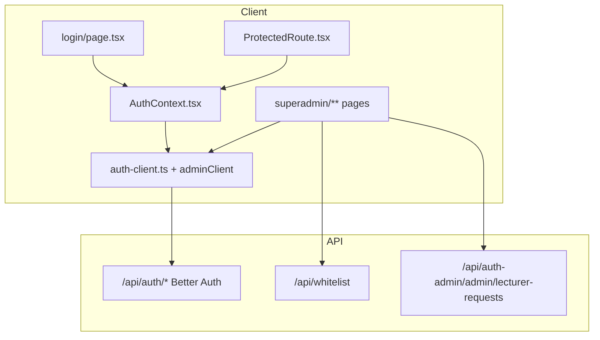

# Super Admin Real API Integration Plan

## Summary

Mục tiêu: hoàn thiện khu vực Super Admin (`/superadmin/**`) bằng cách thay mock data / localStorage bằng session Better Auth thật, `adminClient` plugin, và các REST endpoint đã có trên backend.

**Phạm vi:** Auth nền tảng (AuthContext, ProtectedRoute, login), superadmin routes, role `ADMIN | LECTURER | STUDENT` toàn app.

**Ngoài phạm vi:** Impersonation banner toàn app (user xác nhận **không làm**); teacher/student portal business logic (chỉ cập nhật role guard).

> **API contract:** `docs/api/00_auth.md` là đặc tả API lấy từ BE — **source of truth** khi implement frontend (Admin plugin mục 3, Whitelist mục 4). Lecturer requests bổ sung từ `api/src/` vì chưa có trong `00_auth.md` (Phase 6 docs).

---

## Hiện trạng (Gap Analysis)

| Thành phần | Hiện tại | Mục tiêu |
|---|---|---|
| `web/lib/auth-client.ts` | `createAuthClient` không plugin | Gắn `adminClient` |
| `web/app/contexts/AuthContext.tsx` | `mockUsers` + localStorage | `authClient.signIn.email` / `useSession` / `signOut` |
| `web/components/ProtectedRoute.tsx` | Role `"superadmin"` | Role `"ADMIN"` từ session |
| `web/app/superadmin/admins/page.tsx` | Mock admin list | Giữ route `/superadmin/admins` — user list tất cả role + create |
| `web/app/superadmin/admins/[id]/page.tsx` | **Chưa có** | User detail + admin actions |
| `web/app/superadmin/lecturer-requests/page.tsx` | **Chưa có** | Approve/Reject lecturer requests |
| `web/app/superadmin/page.tsx` | Hardcoded stats | Số liệu thật từ API |
| `web/app/superadmin/whitelist/page.tsx` | Local state | `GET/POST/DELETE /api/whitelist` |
| Impersonation banner | Không có | **Bỏ qua** (user confirm không làm); vẫn có impersonate trên user detail nếu cần |

### API routing — đọc từ `api/src/index.ts` (source of truth)

Backend chia **3 nhóm route** khác nhau, không gộp chung:

| Nhóm | Mount trong `index.ts` | Ví dụ |
|---|---|---|
| Better Auth (gồm Admin plugin) | `app.on("/api/auth/*")` → `auth.handler` | `POST /api/auth/sign-in/email`, `GET /api/auth/admin/list-users` |
| Whitelist REST (Hono) | `app.route("/api/whitelist", whitelistRouter)` | `GET /api/whitelist`, `POST /api/whitelist/import` |
| Lecturer Request (Hono) | `app.route("/api/auth-admin", lecturerRequestRouter)` | Xem bảng dưới |

**Lecturer Request — path đầy đủ** (`lecturer-request.controller.ts` + mount `/api/auth-admin`):

| Thao tác | Method | Path đầy đủ | Auth |
|---|---|---|---|
| Gửi yêu cầu (public) | `POST` | `/api/auth-admin/lecturer-request` | Không |
| Danh sách (admin) | `GET` | `/api/auth-admin/admin/lecturer-requests` | ADMIN session |
| Duyệt | `POST` | `/api/auth-admin/admin/lecturer-requests/:requestId/approve` | ADMIN session |
| Từ chối | `POST` | `/api/auth-admin/admin/lecturer-requests/:requestId/reject` | ADMIN session |

**Response shapes (từ controller):**
- List: `{ requests: LecturerRequest[] }` — sắp xếp `status asc`, `createdAt desc`
- Approve OK: `{ success, message, credentials: { email, temporaryPassword } }`
- Reject OK: `{ success: true }`

> Lưu ý: **Không** có route `/api/admin/lecturer-requests`. Prefix đúng là `/api/auth-admin/admin/...` (mount `auth-admin` + path `admin/lecturer-requests` trong router).

### Role mapping

| Backend (Better Auth) | Frontend mock cũ | Portal route |
|---|---|---|
| `ADMIN` | `superadmin` | `/superadmin` |
| `LECTURER` | `teacher` | `/teacher` |
| `STUDENT` | `student` | `/student` |

`UserRole` trong AuthContext sẽ đổi sang `ADMIN | LECTURER | STUDENT` (khớp backend).

---

## Sitemap & Endpoint Map

```
/superadmin
  └─ Dashboard stats
       ├─ authClient.admin.listUsers({ filterField:"role", filterValue:"ADMIN" }) → total admin
       ├─ GET /api/whitelist?limit=1 → pagination.total
       └─ GET /api/whitelist?limit=1 → pagination.total (§4.1)

/superadmin/admins
  └─ authClient.admin.listUsers (search, pagination, role filter)
       ├─ POST authClient.admin.createUser
       └─ Link → /superadmin/admins/[id]

/superadmin/admins/[id]
  └─ authClient.admin.getUser? hoặc listUsers + id
       ├─ authClient.admin.setRole
       ├─ authClient.admin.banUser / unbanUser
       ├─ authClient.admin.setUserPassword
       ├─ authClient.admin.removeUser
       ├─ authClient.admin.impersonateUser
       ├─ authClient.admin.listUserSessions
       └─ authClient.admin.revokeUserSession

/superadmin/whitelist
  ├─ GET    /api/whitelist
  ├─ POST   /api/whitelist
  ├─ POST   /api/whitelist/import
  └─ DELETE /api/whitelist/:id
```

> **Lecturer requests:** Không có trong `00_auth.md` → **không** thêm nav/trang Phase 5.

Tất cả fetch REST dùng `credentials: "include"`. Admin plugin gọi qua `authClient` (cookie session tự gửi).

---

## Kiến trúc Frontend



**Shared helper (trong `auth-client.ts`, không tạo file song song):**

```ts
export const apiBaseUrl = process.env.NEXT_PUBLIC_API_BASE_URL ?? "http://localhost:8000";

export async function apiFetch<T>(path: string, init?: RequestInit): Promise<T> {
  const res = await fetch(`${apiBaseUrl}${path}`, { credentials: "include", ...init });
  // parse JSON, throw on !res.ok
}
```

---

## File Change Matrix

### Phase 1 — Auth Foundation

| # | File | Thay đổi | API / Method |
|---|---|---|---|
| 1.1 | `web/lib/auth-client.ts` | Import `adminClient`, export `authClient`, `apiBaseUrl`, `apiFetch` | Better Auth client |
| 1.2 | `web/app/contexts/AuthContext.tsx` | Xóa mock; `useSession`; `signIn.email`; `signOut`; expose `session`, `impersonatedBy`, `isLoading` | `POST /api/auth/sign-in/email`, `GET /api/auth/get-session`, `POST /api/auth/sign-out` |
| 1.3 | `web/components/ProtectedRoute.tsx` | `allowedRoles: ("ADMIN"\|"LECTURER"\|"STUDENT")[]`; redirect theo role thật | Session role |
| 1.4 | `web/app/login/page.tsx` | Login qua AuthContext thật; redirect theo `user.role`; bỏ/giảm demo bypass admin | `signIn.email` |
| 1.5 | `web/app/teacher/layout.tsx` | `allowedRoles={["LECTURER"]}` | — |
| 1.6 | `web/app/student/layout.tsx` | `allowedRoles={["STUDENT"]}` | — |
### Phase 2 — Superadmin Shell

| # | File | Thay đổi | API / Method |
|---|---|---|---|
| 2.1 | `web/app/superadmin/layout.tsx` | Nav: Users, Whitelist, Lecturer Requests; `allowedRoles={["ADMIN"]}`; logout async | — |
| 2.2 | `web/app/superadmin/page.tsx` | `useEffect` fetch 3 stats; loading skeleton; shortcuts trỏ route mới | `listUsers`, `/api/whitelist`, lecturer-requests |

### Phase 3 — Admins / Users (giữ route `/superadmin/admins`)

| # | File | Thay đổi | API / Method (theo `00_auth.md` mục 3) |
|---|---|---|---|
| 3.1 | `web/app/superadmin/admins/page.tsx` | Sửa tại chỗ: bảng phân trang, search, filter role, Create User modal | `list-users`, `create-user` |
| 3.2 | `web/app/superadmin/admins/[id]/page.tsx` | **Mới**: profile, role, sessions, ban/unban, reset password, delete, impersonate | `get-user`, `set-role`, `ban-user`, … |

**Create User modal fields:** `name`, `email`, `password` (optional), `role` (STUDENT|LECTURER|ADMIN).

**User Detail — guard rules:**
- Disable ban/delete/setRole/impersonate khi `targetId === currentUser.id`
- `modals.openConfirmModal` trước ban/delete/đổi role
- Sau impersonate: `router.push` theo role target + reload session

### Phase 4 — Whitelist

| # | File | Thay đổi | API / Method |
|---|---|---|---|
| 4.1 | `web/app/superadmin/whitelist/page.tsx` | Fetch on mount + pagination server-side; thay `confirm`/`alert` bằng notifications + confirm modal | `GET/POST /api/whitelist`, `POST /api/whitelist/import`, `DELETE /api/whitelist/:id` |

**Response shape:** `{ emails: [{id, email, addedAt}], pagination }`.

### Phase 5 — Lecturer Requests (trang mới)

| # | File | Thay đổi | API / Method |
|---|---|---|---|
| 5.1 | `web/app/superadmin/lecturer-requests/page.tsx` | **Mới**: table PENDING/APPROVED/REJECTED; nút Approve/Reject; Modal hiển thị `credentials.temporaryPassword` sau approve | Lecturer request endpoints |

**Approve success modal:** hiển thị email + temporaryPassword (copy button); dùng `@mantine/notifications` cho lỗi/thành công.

### Phase 6 — Docs (sau code, nếu có thay đổi hành vi)

| # | File | Thay đổi |
|---|---|---|
| 6.1 | `docs/api/00_auth.md` | Thêm mục Lecturer Requests với path `/api/auth-admin/...`; sửa typo "4.3 create-user" → "3.3" |

---

## TODO Tasks (Implementation Checklist)

### Phase 0 — Prep
- [ ] **T0.1** Đảm bảo `.env` root có `NEXT_PUBLIC_API_BASE_URL=http://localhost:8000` và admin seed (`admin@fpt.edu.vn`) tồn tại

### Phase 1 — Auth Foundation
- [x] **T1.1** Gắn `adminClient` vào `auth-client.ts` + `apiFetch` helper
- [x] **T1.2** Refactor `AuthContext.tsx` sang Better Auth session
- [x] **T1.3** Cập nhật `ProtectedRoute.tsx` role `ADMIN`
- [x] **T1.4** Cập nhật `login/page.tsx` login thật + redirect theo role
- [x] **T1.5** Cập nhật teacher/student layout role guards
- [x] **T1.6** `npm run build` trong `web/` — fix type errors

### Phase 2 — Dashboard
- [x] **T2.1** `superadmin/page.tsx` — fetch stats thật (admin, whitelist, total users), loading states
- [x] **T2.2** `superadmin/layout.tsx` — nav giữ 3 mục (không lecturer-requests)
- [x] **T2.3** `npm run build` — verify

### Phase 3 — Admins / Users
- [x] **T3.1** Sửa `superadmin/admins/page.tsx` (list + create modal, API thật)
- [x] **T3.2** Tạo `superadmin/admins/[id]/page.tsx` (detail + admin actions)
- [x] **T3.3** Self-guard + confirm modals
- [x] **T3.4** `npm run build` — verify

### Phase 4 — Whitelist
- [x] **T4.1** Tích hợp API whitelist + pagination + notifications
- [x] **T4.2** `npm run build` — verify

### Phase 5 — Lecturer Requests
- ~~Đã hủy~~ — không có trong `00_auth.md`

### Phase 6 — Quality Gate
- [ ] **T6.1** Delegate `code-reviewer` — review toàn bộ diff
- [ ] **T6.2** Delegate `docs-manager` — cập nhật `docs/api/00_auth.md`
- [ ] **T6.3** Manual smoke test checklist (bên dưới)

---

## UI/UX Conventions (giữ nguyên design hiện có)

- Mantine v9: `radius={0}`, palette `#1A3A5C` / `#F26F21`
- `@mantine/notifications` cho success/error (đã mount trong `providers.tsx`)
- `@mantine/modals` `openConfirmModal` cho destructive actions
- Loading: `Loader` full-section hoặc `Table` skeleton rows
- Không dùng `alert()` / `confirm()` native

---

## TypeScript Types (đề xuất inline trong từng page hoặc `AuthContext`)

```ts
type BackendRole = "ADMIN" | "LECTURER" | "STUDENT";

interface WhitelistEmail {
  id: string;
  email: string;
  addedAt: string;
}

interface LecturerRequest {
  id: string;
  name: string;
  email: string;
  reason: string;
  status: "PENDING" | "APPROVED" | "REJECTED";
  createdAt: string;
  reviewedAt?: string | null;
}
```

---

## Manual Smoke Test Checklist

1. Login `admin@...` → redirect `/superadmin`, session cookie set
2. Dashboard hiển thị số admin / whitelist / pending requests khớp DB
3. Users list: search, filter role, pagination, create user
4. User detail: đổi role (confirm), ban/unban, reset password, revoke session
5. Không thể ban/xóa/đổi role chính mình (nút disabled)
6. Impersonate user → chuyển portal theo role (không có banner)
7. Whitelist CRUD + bulk import
8. Lecturer request approve → modal password; reject → status cập nhật
9. Logout xóa session, ProtectedRoute redirect `/login`
10. Non-admin vào `/superadmin` → redirect đúng portal

---

## Rủi ro & Giảm thiểu

| Rủi ro | Giảm thiểu |
|---|---|
| CORS cookie không gửi | `credentials: "include"`; backend `trustedOrigins` đã có localhost:3000 |
| `listUsers` không filter role | Fallback: fetch + client filter hoặc dùng `filterField`/`filterValue` của admin plugin |
| Login teacher/student vỡ do đổi role type | Cập nhật đồng bộ teacher/student layout trong Phase 1 |
| Nhầm `/api/admin` vs `/api/auth-admin` | Bám `api/src/index.ts` + controller; cập nhật docs |

---

## Thứ tự thực thi đề xuất

```
Phase 1 (Auth) → Phase 2 (Shell) → Phase 3 (Users) → Phase 4 (Whitelist) → Phase 5 (Lecturer) → Phase 6 (Review/Docs)
```

**Ước lượng:** ~16h (Auth 4h, Users 6h, Whitelist 2h, Lecturer 2h, Dashboard/Shell 1h, QA 1h).

---

## Quyết định đã chốt (2026-07-08)

| # | Quyết định |
|---|---|
| 1 | **Giữ** route `/superadmin/admins` (+ thêm `/superadmin/admins/[id]`) — không đổi sang `/users` |
| 2 | Role type `ADMIN \| LECTURER \| STUDENT` **toàn app** (AuthContext, ProtectedRoute, login redirect) |
| 3 | **Không** làm Impersonation banner toàn app |
| 4 | API contract: bám **`docs/api/00_auth.md`** (BE spec); lecturer requests từ `api/src/` cho đến khi docs bổ sung |

**Trạng thái:** Approved — sẵn sàng Phase 1.
